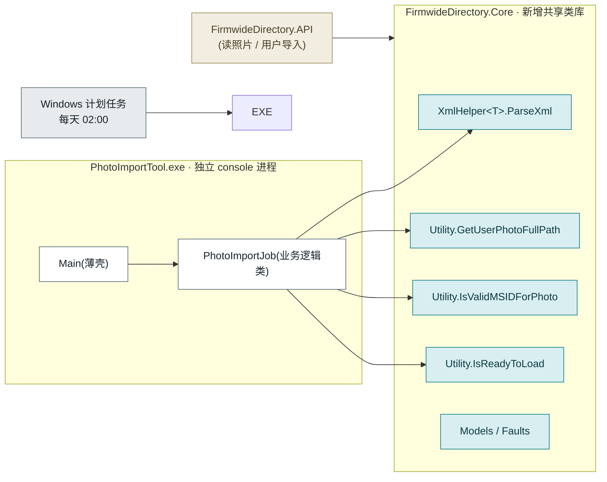
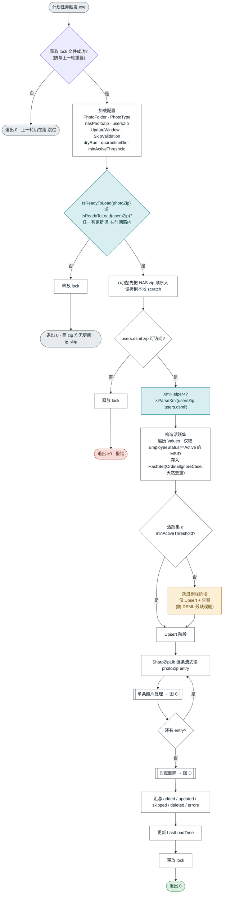
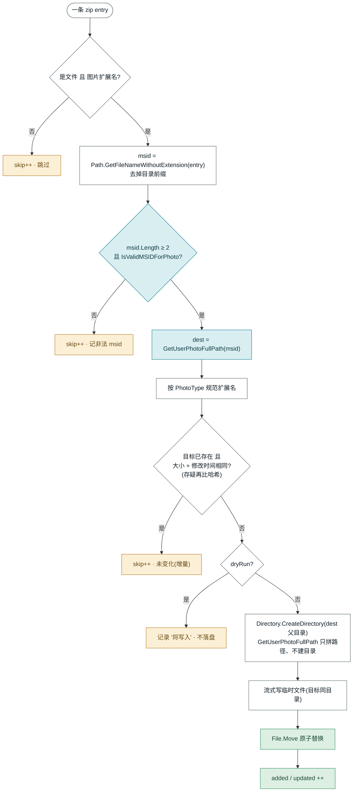
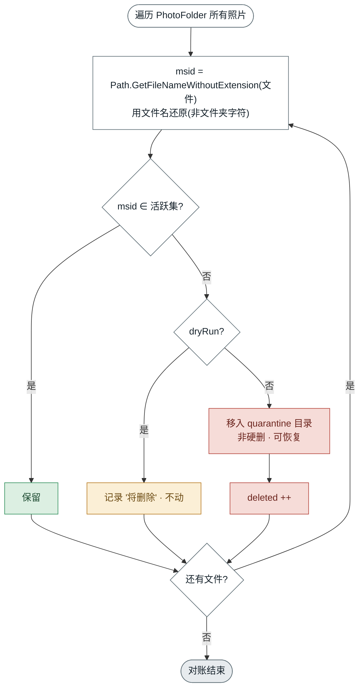

# 照片导入实现方案(方案 A) — Console EXE + Windows 计划任务

> 目标:把 global 下发的照片 zip(位于 NAS 共享)解压、按 MSID 两级分桶落盘,并按 `users.dsml` 清理非活跃用户照片。
> 现状约束:后端为**单工程 monolith**;Hangfire 只搭了架子但**未通电**(依赖的 PostgreSQL 不存在);照片 zip 在 **NAS 共享**,内含**较大的 .jpg**。
> 结论:**独立 console exe + Windows 计划任务**,代码复用走 **方案 A(抽最小 `FirmwideDirectory.Core` 共享库)**。不为此功能引入 PostgreSQL。

---

## 0 · 为什么是这个方案

| 选项 | 现状下的判断 |
|---|---|
| 用 Hangfire recurring job | ❌ Hangfire 未通电(无 PostgreSQL);为一天一次的作业搭 Postgres 严重不成比例 |
| API 内 `BackgroundService` 定时器 | ❌ 重 NAS I/O 跑进 API 进程,抢资源;多实例会重复跑 |
| **Console exe + 计划任务** | ✅ 零基础设施依赖、天然进程隔离、可部署到能访问 NAS 的主机、与幂等设计契合 |

**可逆性**:业务逻辑全部写在一个类里,`Main` 只做薄壳调用。将来若 Postgres/Hangfire 落地,把该类改挂成 Hangfire job 即可,不锁死当前选择。

---

## 1 · 组件与依赖(方案 A:抽最小 Core 库)

把 `Models + Faults + Common` 抽成一个 class library `FirmwideDirectory.Core`,由 **API** 与新的 **PhotoImportTool.exe** 同时引用。核心目的:**`GetUserPhotoFullPath` 的两级分桶规则与 API 字节级一致,杜绝漂移。**

**图例**:🟦 复用(移入 Core 的现有代码) · ⬜ 新写 · 🟨 现有 API

---

## 2 · 端到端主流程

调度由**计划任务**驱动;防重叠靠 **lock 文件**(取代 Hangfire 的隐身超时机制);变更判断靠 `IsReadyToLoad`。

> **优雅停机**:主循环携带取消标记;计划任务/关机中断时,因幂等可下次从头扫、跳过未变化文件,等价断点续传。
>
> **G2 · 为何门闸对两个 zip 取「或」**:清理非活跃照片依赖 `users.dsml`。若只门控 photo zip,则「仅 users 更新(有人离职)、photo zip 未变」时整轮 skip,非活跃照片永远清不掉——这正是需求 4/5 的核心场景。故任一 zip 更新即进入本轮;一旦进入,对账删除阶段总会用最新活跃集执行。photo zip 未变时 Upsert 各条命中「未变化 skip」,开销很小。

---

## 3 · 单条照片处理(Upsert)

> **为何临时文件 + `File.Move`**:目标目录正被 API 读取。就地覆盖会出现"读到半截"窗口;先写同目录临时文件再原子 `Move`,API 要么读到旧的、要么读到新的。
>
> **G1 · 必须显式建目录**:`GetUserPhotoFullPath` 只**拼路径不建目录**(注释即写 "The folder will be created in advance"),且当**根 `PhotoFolder` 不存在时会直接抛异常**(`Utility.cs:334`)。因此 exe 需:① 启动时确保根 `PhotoFolder` 存在;② 每次写盘前 `Directory.CreateDirectory(dest 父目录)` 建出 `5\8\` 两级子目录。否则 Upsert 落盘必失败。
>
> **N1 · 文件名→MSID**:zip entry 可能带目录前缀、大小写扩展名、混入非图片文件。取 `Path.GetFileNameWithoutExtension` 拿到裸 msid,再过 `IsValidMSIDForPhoto` + 长度≥2;非图片扩展名直接 skip。

---

## 4 · 对账删除(非活跃)

> **N2 · 对账阶段如何还原 msid**:落盘时 `GetUserPhotoFullPath` 对**文件夹字符**做了 `ToUpper`,但**文件名保留原始大小写**(`Utility.cs:344`)。因此对账必须用**文件名**(`Path.GetFileNameWithoutExtension`)还原 msid,不能用文件夹字符;活跃集是 `OrdinalIgnoreCase` 的 `HashSet`,大小写差异不会误删。

---

## 5 · 删除语义(关键)

源自 `XmlHelper.ParseXml → PostProcess`:解析结果**只含 Active + Inactive**,`Terminated` / `Pending` 被直接丢弃。活跃集 = **仅 Active**。

| EmployeeStatus | 在 ParseXml 结果中? | 在活跃集? | 照片处理 |
|---|---|---|---|
| `A` Active | 是 | 是 | **保留 / 更新** |
| `I` Inactive | 是 | 否 | **删除 → 隔离** |
| `T` Terminated | 否(丢弃) | 否 | **删除 → 隔离** |
| `P` Pending | 否(丢弃) | 否 | **删除 → 隔离** |
| 其它 / 缺 MSID | 否 | 否 | 删除候选 · 靠阈值兜底 |

> **阈值保护**:若某天 `users.dsml` 残缺导致活跃集异常偏小,严格对账会误删大批在职照片。`minActiveThreshold` 不满足时**只做 Upsert、跳过删除并告警**。

---

## 6 · 大文件 + NAS 必须处理的 5 个坑

| # | 坑 | 对策 |
|---|---|---|
| 1 | **作业重叠** | 计划任务可能与上一轮长作业重叠 → 启动即取 **lock 文件 / mutex**,未取到直接退出 |
| 2 | **内存** | 大 jpg **逐 entry 带 buffer 流式写盘**;禁止整包 `ExtractToDirectory` 或整图 load 内存 |
| 3 | **NAS 健壮性** | 瞬时 IO 错误**有限重试**;可选:先把 NAS zip **顺序大读**拷到本地 scratch 再解压,减少长时间 SMB 句柄占用 |
| 3b | **增量判断成本** | 每轮对全量已落盘照片算哈希 = 不小的 NAS I/O。先用**大小 + LastWriteTime** 快速判断,仅存疑时再比哈希 |
| 4 | **目标写入原子性** | 临时文件同目录 + `File.Move`,API 不会读到半截 |
| 5 | **长作业遇重启** | 携带 `CancellationToken` 优雅停机;幂等设计使重跑跳过未变化文件(断点续传效果) |

---

## 7 · 复用清单(方案 A)

| 流水线步骤 | 来源(移入 `FirmwideDirectory.Core`) | 状态 |
|---|---|---|
| 变更判断(zip 是否更新 / 时间窗) | `Utility.IsReadyToLoad` | 复用 |
| 解析 users.dsml → 用户 + 状态 | `XmlHelper<T>.ParseXml` | 复用 |
| 照片落盘路径 `5\8\58NVV.jpg` | `Utility.GetUserPhotoFullPath` | 复用 |
| MSID 校验 | `Utility.IsValidMSIDForPhoto` | 复用 |
| 解压照片 zip 并分发到子目录 | SharpZipLib(参照 ParseXml 读法) | 新写 |
| 活跃集构造(去重 + 仅 Active) | — | 新写 |
| 增量判断 / 临时文件 + 原子 Move | — | 新写 |
| 对账删除 → quarantine | — | 新写 |
| lock 防重叠 / 汇总报告 / 退出码 / dry-run | — | 新写 |

---

## 8 · Core 库抽取要点(方案 A 的一次性成本)

**移入 Core**:`Models` + `Faults` + `Common`(`Utility`、`XmlHelper`)。
**不移入**:`Controllers / Middlewares / Hangfire / Services / DataAccess / Repository / StateMachine / DataTransfer / Extensions`。

抽取时的注意事项(避免把框架依赖带进库):

1. **清理框架耦合**:`XmlHelper.cs` 顶部有 `using Microsoft.AspNetCore.Http.Features;`,`Utility` 用了 `ILogger` / `WebProxy`。库里只允许依赖 `Microsoft.Extensions.Logging.Abstractions`,**不得依赖 ASP.NET**。先删无用 using、日志换 Abstractions。
2. **传递依赖**:`Models` 可能反向引用 `DataTransfer / Extensions`,"编译-看报错"逐个收敛,必要时把真正共享的类型一起下沉。
3. **这是生产单体上的重构**,须配回归测试(用户导入路径尤其要验证:API 仍能正常 `ParseXml` 加载用户/组)。
4. **SharpZipLib** 依赖随 `Common` 进入 Core;API 与 exe 版本保持一致。

---

## 9 · 配置项(建议与 API 共享同一 `PhotoOptions`)

| 配置 | 含义 | 备注 |
|---|---|---|
| `PhotoFolder` | 照片根目录(API 读、exe 写) | **exe 与 API 必须同值** |
| `PhotoType` | 扩展名(如 `.jpg`) | **exe 落盘扩展名必须等于此值** |
| `nasPhotoZip` | NAS 上照片 zip 路径 | exe 输入 |
| `usersZip` / `usersDsmlName` | users.dsml 所在 zip 及内部文件名 | 供 `ParseXml` |
| `UpdateWindow` / `SkipValidation` | 时间窗 / 跳过变更校验 | 供 `IsReadyToLoad` |
| `dryRun` | 只报告不落盘/不删除 | 上线前演练 |
| `quarantineDir` | 删除照片的隔离目录 | 非硬删,可恢复 |
| `minActiveThreshold` | 活跃集下限,低于则跳过删除 | 防 DSML 残缺误删 |

---

## 10 · 动手前仍需拍板的问题

| # | 问题 | 说明 |
|---|---|---|
| ~~Q1~~ | ~~`ParseXml` 的泛型 `T` 用哪个?~~ | ✅ **已关闭**:`T = GlobalUserAccount`。同步后的 `XmlHelper.cs` 两处已一致(`:218` propertyMapper、`:261` item 均判 `GlobalUserAccount`),不再互斥。 |
| **Q2** | 扩展名:zip 内是 `.png` 还是 `.jpg`? | 路径靠 `{msid}{PhotoType}` 拼,exe 落盘扩展名必须等于后端 `PhotoType`,否则 API 永远读不到。 |
| **Q3** | 删除范围:只删 Inactive,还是删"非 Active"全部? | 推荐"非 Active 即删除候选 + 阈值兜底 + quarantine";需业务确认是否接受连 Terminated/Pending 一并清理。 |
| **Q4** | 部署主机 | exe 需部署在**能同时访问 NAS 照片 zip 与目标 `PhotoFolder`** 的主机上;计划任务在该主机注册。 |

---

## 11 · 评审意见处置(review disposition)

| 编号 | 意见 | 核实结果 | 处置 |
|---|---|---|---|
| **G1** | `GetUserPhotoFullPath` 只拼路径不建目录,Upsert 写盘会失败 | ✅ 属实(`Utility.cs:332-359` 只拼+校验;`:334` 根目录不存在直接抛) | **已采纳** → §3 增 `Directory.CreateDirectory` + 根目录预建(见 §3 note) |
| **G2** | 只门控 photo zip,users.dsml 单独更新时清理不跑 | ✅ 属实,需求 4/5 核心场景 | **已采纳** → §2 门闸改为 photo/users 两 zip 取「或」 |
| **N1** | 文件名→MSID 解析规则未定义 | ✅ 合理 | **已采纳** → §3 用 `GetFileNameWithoutExtension` + 校验 |
| **N2** | 对账 msid 还原须与落盘规则一致 | ✅ 属实(`Utility.cs:344` 文件夹 `ToUpper`、文件名保原样) | **已采纳** → §4 用文件名还原、`OrdinalIgnoreCase` 比较 |
| **N3** | 每轮全量算哈希成本高 | ✅ 合理 | **已采纳** → §3/§6 改「大小+修改时间」优先,存疑再哈希 |
| **N4** | "Values 去重"可简化 | ⚠️ 半对:字典是 **mail+msid 双键**,`.Values` 会重复;但 `HashSet<MSID>` 本就去重 | **已采纳(措辞简化、理由更正)** → §2 BS 节点 |
| **Q1** | 建议关闭:`T = GlobalUserAccount` | ✅ 结论正确(引用行号 230/277 有误)。**旧版**源码 `:219` 曾是 `T==GlobalUser`、`:259` 是 `GlobalUserAccount`,两者互斥;用户**同步最新文件**后,`:218` propertyMapper 与 `:261` item 均判 `GlobalUserAccount`,已自洽 | **已关闭** → `T = GlobalUserAccount`(见 §10) |

> Q1 处置说明:首轮基于旧版本源码驳回是正确的(那版确有 `GlobalUser` vs `GlobalUserAccount` 互斥,两种 `T` 都跑不通);用户同步最新 `XmlHelper.cs` 后不一致已消除,故正式关闭,`T = GlobalUserAccount`。

---

*本文档为评审用设计,未改动任何源码。G1/G2 及 N1–N4 已并入;Q1 已关闭(`T = GlobalUserAccount`),Q2–Q4 仍需业务/环境确认。确认后再落 `FirmwideDirectory.Core` 抽取与 exe 骨架。*
