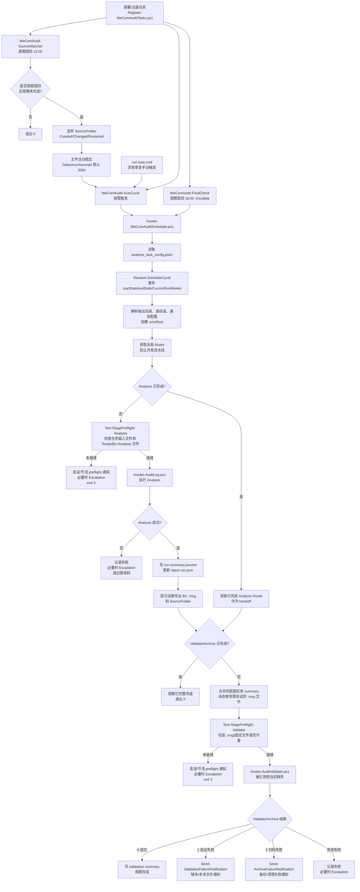
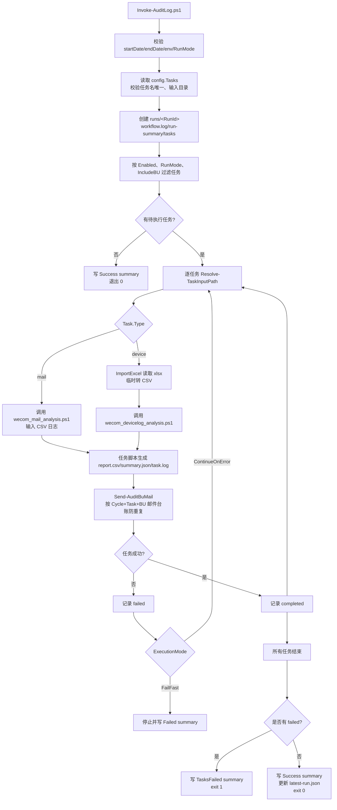
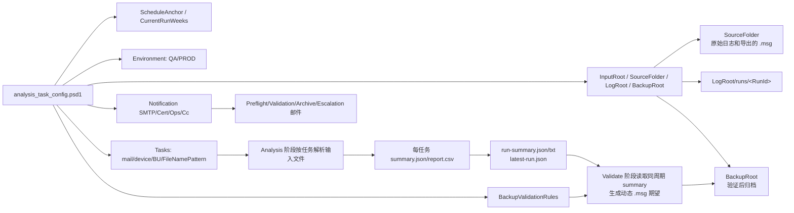

# WeCom Audit 项目流程图

## 当前实现思路

项目是一个基于 PowerShell 的企业微信审计自动化流水线。核心思路是把整个周期收敛到一个零参数状态机：`Invoke-WeComAuditScheduler.ps1` 根据 `analysis_task_config.psd1` 推导当前审计周期、运行环境、输入目录、输出目录和通知配置，然后按磁盘状态决定是否执行 `Analysis`、`Validate + Archive`，或直接退出。

入口触发有三类：

- `WeComAudit-SourceWatcher`：周期周四 10:00 启动，监听源目录文件变化，文件稳定后触发 `WeComAudit-AutoCycle`。
- `WeComAudit-FinalCheck`：周期周四 18:00 触发同一状态机，并带 `-Escalate`，用于最后检查和升级通知。
- `run-now.cmd`：异常恢复按钮，手动触发 `WeComAudit-AutoCycle`。

当前工作区有一个完整的调度/分析框架，但 `Invoke-WeComAuditScheduler.ps1` 引用的 `Invoke-AuditValidate.ps1` 未在当前目录和 `wecom_cleaned.zip` 中出现；压缩包中包含 `wecom_mail_analysis.ps1`、`wecom_devicelog_analysis.ps1` 和 `Invoke-BuMailResend.ps1`，当前目录未展开这些文件。所以下面的 Validate/Archive 阶段按调度器调用约定和公共模块能力描述。

## 总体流程图

## Analysis 子流程

## 配置与数据流

## 关键设计点

- 单入口状态机：Watcher、FinalCheck、手动按钮都触发同一个 `Invoke-WeComAuditScheduler.ps1`，重复触发依靠 cycle guard 和邮件 ledger 保持幂等。
- 周期从 `ScheduleAnchor` 推导：避免手工传日期或计划任务相位错位。
- 两阶段处理：上午/原始日志到齐后执行 Analysis；下午/BU `.msg` 导出后执行 Validate + Archive。
- Preflight 先于实际执行：缺文件时退出码为 3，并通过通知提醒，而不是进入半完成处理。
- 输出按 `runs/<RunId>` 隔离：每次 Analysis 生成独立运行目录，同时 `latest-run.json` 做阶段交接。
- 邮件发送有 ledger：`Send-AuditBuMail` 按 Cycle、Task、BU 和内容哈希控制重复发送。
- 归档清理有安全检查：公共模块提供备份内容验证、源文件哈希对比、允许根目录校验和带重试删除。

## 当前项目完整性观察

- 当前目录缺少 `Invoke-AuditValidate.ps1`，调度器启动时会直接检查该文件；若生产包也缺失，Validate 阶段无法运行。
- 当前目录缺少 `wecom_mail_analysis.ps1`、`wecom_devicelog_analysis.ps1`、`modules/ImportExcel`，但 `wecom_cleaned.zip` 内含两个分析脚本，不含 `ImportExcel` 模块。
- `analysis_task_config.psd1` 当前环境为 `QA`，启用任务主要是 `mail-msms` 和 `device-msms-member-records`，多数 BU/设备任务处于 `Enabled = false`。
