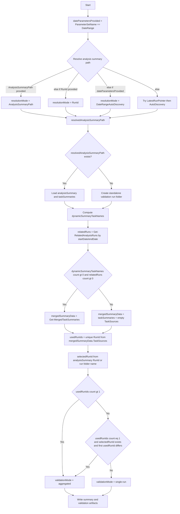

```mermaid
flowchart TD
    A[Start] --> B[dateParametersProvided = ParameterSetName == DateRange]
    B --> C{Resolve analysis summary path}
    C -->|AnalysisSummaryPath provided| C1[resolutionMode = AnalysisSummaryPath]
    C -->|else if RunId provided| C2[resolutionMode = RunId]
    C -->|else if dateParametersProvided| C3[resolutionMode = DateRangeAutoDiscovery]
    C -->|else| C4[Try LatestRunPointer then AutoDiscovery]

    C1 --> D[resolvedAnalysisSummaryPath]
    C2 --> D
    C3 --> D
    C4 --> D

    D --> E{resolvedAnalysisSummaryPath exists?}
    E -->|Yes| F[Load analysisSummary and taskSummaries]
    E -->|No| G[Create standalone validation run folder]
    F --> H[Compute dynamicSummaryTaskNames]
    G --> H

    H --> I[relatedRuns = Get-RelatedAnalysisRuns by startDate/endDate]
    I --> J{dynamicSummaryTaskNames count gt 0 and relatedRuns count gt 0}
    J -->|Yes| K[mergedSummaryData = Get-MergedTaskSummaries]
    J -->|No| L[mergedSummaryData = taskSummaries + empty TaskSources]

    K --> M[usedRunIds = unique RunId from mergedSummaryData.TaskSources]
    L --> M
    M --> N[selectedRunId from analysisSummary RunId or run folder name]

    N --> O{usedRunIds count gt 1}
    O -->|Yes| P[validationMode = aggregated]
    O -->|No| Q{usedRunIds count eq 1 and selectedRunId exists and first usedRunId differs}
    Q -->|Yes| P
    Q -->|No| R[validationMode = single-run]

    P --> S[Write summary and validation artifacts]
    R --> S

```
