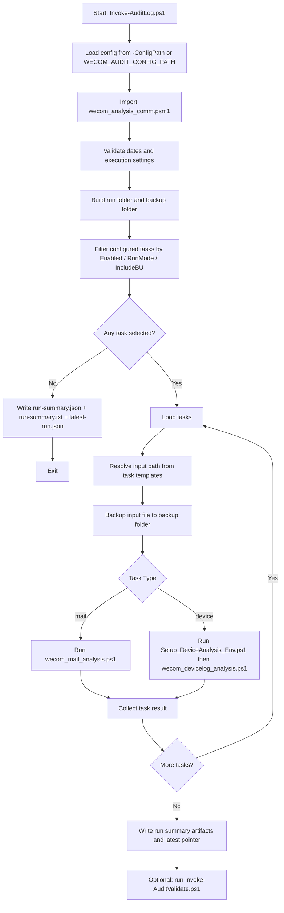
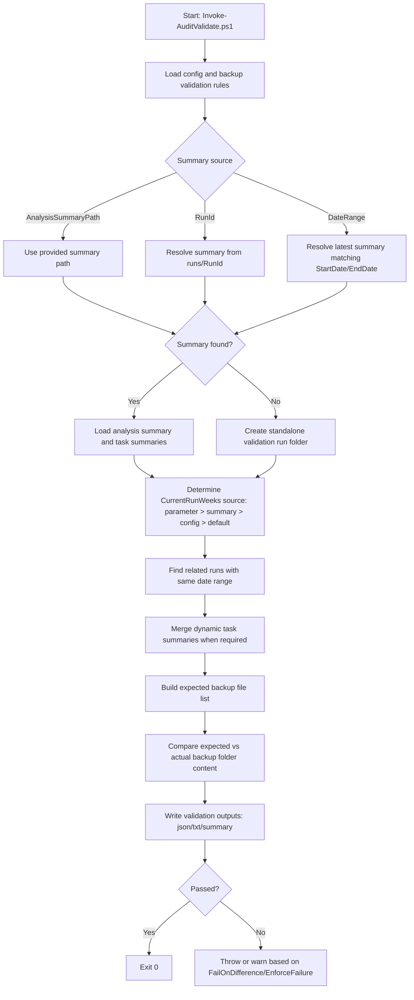

# WeCom Audit Workflow

This document summarizes the current PowerShell project workflow for:

- Mail log analysis
- Device log analysis
- Backup folder validation

The entry points are:

- `Invoke-AuditLog.ps1` (analysis orchestrator)
- `Invoke-AuditValidate.ps1` (post-analysis backup validation)

---

## 1. High-Level Flow

---

## 2. Analysis Pipeline Details

### 2.1 `Invoke-AuditLog.ps1` responsibilities

- Reads and validates configuration (`analysis_task.config.psd1`)
- Resolves runtime defaults:
  - `ExecutionMode` (`FailFast` / `ContinueOnError`)
  - `OutputRoot`
  - date token map for file templates
- Pre-checks input directories via module helper
- Executes each selected task and captures:
  - status (`completed`, `failed`, `skipped`)
  - report path, summary path, task log path
- Writes:
  - `run-summary.json`
  - `run-summary.txt`
  - `runs/latest-run.json`

### 2.2 Mail branch (`wecom_mail_analysis.ps1`)

- Imports CSV mail log
- Detects potential violations by sender/recipient/status/domain rules
- Sends violation/no-violation notification emails
- Writes task-level artifacts:
  - `report.csv`
  - `summary.json` (via `Save-AnalysisSummary`)

### 2.3 Device branch (`Setup_DeviceAnalysis_Env.ps1` + `wecom_devicelog_analysis.ps1`)

- Bootstraps Python virtual environment and dependency (`openpyxl`)
- Converts device XLSX to temporary CSV
- Runs device analysis script
- Query account info via LDAP
- Filters violation records by BU-specific rules
- Sends notification emails
- Writes task-level artifacts:
  - `report.csv`
  - `summary.json` (via `Save-AnalysisSummary`)

---

## 3. Validation Flow (`Invoke-AuditValidate.ps1`)

---

## 4. Shared Module Role (`wecom_analysis_comm.psm1`)

Main reusable capabilities:

- Date parsing and token generation
- Logging helpers
- Config and input directory checks
- Task summary helpers
- Backup validation rule parsing
- Expected file list generation
- Backup folder comparison and report formatting
- Shared artifact utilities (for report folders and summary JSON writing)

---

## 5. Core Artifacts Produced

### Run-level artifacts

- `runs/<RunId>/run-summary.json`
- `runs/<RunId>/run-summary.txt`
- `runs/latest-run.json`

### Task-level artifacts

- `runs/<RunId>/tasks/<task-token>/report.csv`
- `runs/<RunId>/tasks/<task-token>/summary.json`

### Validation artifacts

- `runs/<...>/validation/backup-folder-validation.json`
- `runs/<...>/validation/backup-folder-validation.txt`
- `runs/<...>/validation/backup-validation-summary.json`

---

## 6. Operational Notes

- The workflow is configuration-driven (`Tasks`, `BackupValidationRules`, `ExecutionMode`, `CurrentRunWeeks`).
- `RunMode` controls task type selection (`all`, `mail`, `device`).
- `IncludeBU` can further narrow the execution scope.
- `FailFast` stops on first task failure; `ContinueOnError` continues and reports all outcomes.
- Validation mode can be `single-run` or `aggregated`, depending on merged related runs.

