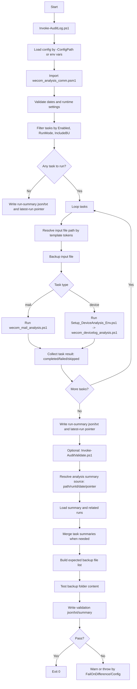

```mermaid
flowchart TD
    A[Start] --> B[Invoke-AuditLog.ps1]
    B --> C[Load config by -ConfigPath or env vars]
    C --> D[Import wecom_analysis_comm.psm1]
    D --> E[Validate dates and runtime settings]
    E --> F[Filter tasks by Enabled, RunMode, IncludeBU]
    F --> G{Any task to run?}
    G -- No --> H[Write run-summary json/txt and latest-run pointer]
    G -- Yes --> I[Loop tasks]

    I --> J[Resolve input file path by template tokens]
    J --> K[Backup input file]
    K --> L{Task type}
    L -- mail --> M[Run wecom_mail_analysis.ps1]
    L -- device --> N[Run Setup_DeviceAnalysis_Env.ps1 -> wecom_devicelog_analysis.ps1]
    M --> O[Collect task result: completed/failed/skipped]
    N --> O
    O --> P{More tasks?}
    P -- Yes --> I
    P -- No --> Q[Write run-summary json/txt and latest-run pointer]

    Q --> R[Optional: Invoke-AuditValidate.ps1]
    R --> S[Resolve analysis summary source: path/runId/date/pointer]
    S --> T[Load summary and related runs]
    T --> U[Merge task summaries when needed]
    U --> V[Build expected backup file list]
    V --> W[Test backup folder content]
    W --> X[Write validation json/txt/summary]
    X --> Y{Pass?}
    Y -- Yes --> Z[Exit 0]
    Y -- No --> Z1[Warn or throw by FailOnDifference/Config]

```