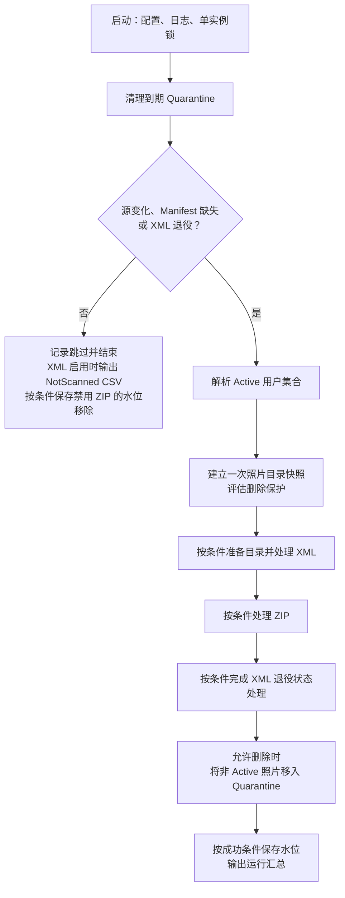

# PhotoImportTool 团队设计讲解

> 工具根据 Active 用户清单，将照片同步到标准目录；XML 优先于可选 ZIP，符合删除条件的非 Active 用户照片进入隔离区，并记录处理结果以支持增量运行和核查。


| 顺序 | 主题 | 建议时间 |
|---|---|---|
| 1 | 输入、输出与业务范围 | 3 分钟 |
| 2 | 水位、覆盖集与 Manifest | 4 分钟 |
| 3 | 一次正常运行的主流程 | 5 分钟 |
| 4 | XML 两遍处理与候选选择 | 7 分钟 |
| 5 | 异常、保护与重试边界 | 4 分钟 |
| 6 | 代码定位、小样本演示与后续演进 | 5 分钟 |

本文用于建立设计认识；详细规则见 [xml_import_photo.md](xml_import_photo.md)，核查说明见 [xml_audit_csv.md](xml_audit_csv.md)，完整手工验证见 [端到端测试用例](photo_import_e2e_user_test_cases.md)。

## 1. 工具当前工作范围

### 输入与输出

| 类型 | 内容 | 作用 |
|---|---|---|
| 必填输入 | Users ZIP / DSML | 提供 Active 用户集合 |
| 照片输入 | XML、可选 Photo ZIP | 至少启用一个照片来源 |
| 业务输出 | PhotoFolder | 存放标准路径下的照片，路径由真实 Core 的 Utility.GetUserPhotoFullPath 计算 |
| 隔离输出 | Quarantine | 暂存非 Active 用户照片，到期清理 |
| 状态文件 | Watermarks、Manifest | 支持后续增量处理 |
| 核查输出 | CSV、运行日志 | 解释处理结果和失败原因 |

### 两种“优先选择”

- XML 与 ZIP 之间：不比较照片时间，也不比较内容；当前采用 XML 覆盖优先策略。
- XML 内部：同一 MSID 存在多个有图候选时，根据 LastModifiedTime 的 UTC 时间选择最新候选。

XML 覆盖集中的用户不会被 ZIP 覆盖。不能把“XML 优先”理解成“XML 失败时自动取 ZIP”；部分错误场景会保留原照片并阻止 ZIP 覆盖。

当前支持 XML-only、ZIP-only、XML 优先并由 ZIP 补充三种来源组合。禁用 Photo ZIP 不会仅因缺少 ZIP 就删除 Active 用户已有照片。

### 同一发布包，不同环境配置

QA 和 PROD 使用同一份完整发布包（包括 EXE 和依赖），真实配置保存在仓库外的受控目录，不随代码提交。

配置加载顺序仅为：**基础 appsettings.json → 外部环境 JSON**。通过 `FWD_PHOTO_CONFIG_FILE` 指定外部文件的绝对路径，例如 appsettings_qa.json 或 appsettings_prod.json；该变量只选择文件，不覆盖业务参数。未提供外部文件中的字段会保留基础配置值。

基础 appsettings.json 仍必须存在。指定的外部文件缺失、不可读取、JSON 格式错误或路径不是绝对路径时，程序拒绝启动。未指定外部文件时只读基础配置；仓库安全默认配置因必填值为空而不能直接导入。详细操作见 [部署配置与内网路径保护](deployment_configuration.md)。

## 2. 三个核心概念

| 概念 | 回答的问题 | 生命周期 |
|---|---|---|
| 源文件水位 Watermarks | 这个源文件是否需要重新处理？ | 跨运行持久化 |
| XML 覆盖集 xmlMsids | 本轮哪些用户不能被 ZIP 覆盖？ | 本轮内存数据 |
| 已应用清单 Manifest | 某用户上次成功应用了哪个 XML 版本？ | 跨运行持久化 |


> 水位决定要不要处理来源，覆盖集决定来源优先级，Manifest 决定某张 XML 照片是否需要写入。

补充说明：

- 水位主要依据源文件 mtime，不是逐张照片的更新时间；Force、Manifest 缺失、XML 退役等情况也参与运行决策。
- XML 覆盖集来自本轮扫描的有效 MSID 有图候选，不等于本轮成功写入集合。
- Manifest 不是“所有 Active 用户照片的完整清单”，也不能直接代替本轮 XML 覆盖集。
- XML 第一遍扫描失败时，历史 Manifest 的 MSID 用于保护已应用的 XML 照片。这是失败保护，不是正常覆盖集的替代来源。

## 3. 正常运行的主流程



讲解时强调三个设计意图：

1. **先判断变化**：避免每次调度都重新导入；Quarantine 到期清理仍在变化判断之前执行。
2. **共用一次目录快照**：Upsert 和删除对账复用，减少 NAS 目录扫描。快照包含路径、MSID 和大小，不读取全部图片内容。
3. **XML 先于 ZIP**：先确定 XML 覆盖范围，避免 ZIP 覆盖 XML 照片。

补充三个容易误解的地方：

- XML 扫描不等于 XML 写入。仅 Photo ZIP 变化且 Manifest 存在时，XML 可以只扫描覆盖集，不解码写入图片。
- 进入正常处理路径后会建立快照；删除保护触发也不取消快照，因为写入判断仍依赖它。全部条件未触发时在入口返回，不扫描照片树。
- 仅 XML 退役触发 ZIP 回落时，非 DryRun 也会执行目录网格准备；已有网格通常走快速路径。DryRun 不预建目录，实际写入仍保留目录缺失时的补建兜底。

主流程讲解不必逐一解释 applyXmlWrites、shouldUpsertZip 等表达式。需要修改运行条件的开发者，再对照代码和详细设计文档阅读。

## 4. 用一个例子讲透 XML 两遍处理

假设同一 MSID 在 XML 中出现以下候选：

| Personnel 序号 | Images 序号 | 图片 | 修改时间（统一按 UTC 展示） |
|---|---|---|---|
| 1 | 1 | A | 09:00 |
| 1 | 2 | B | 11:00 |
| 5 | 1 | C | 10:00 |

这里同时体现两种真实数据情况：重复 Personnel，以及一个 Personnel 下存在多个 Images 块。候选统一按 MSID 分组，不分两套选择逻辑。

### 第一遍：确定“该处理哪张”

1. 完整扫描 XML 结构。
2. 记录 Personnel 和 Images 双序号，判断 Image 是否非空，但不保留完整 Base64。
3. 将同一 MSID 的有图候选统一分组，并建立覆盖集及核查记录。
4. 对需要应用的用户进行有效性、Active 和候选时间检查；Active 过滤受当前 deleteEnabled 规则控制。
5. 所有有图候选的时间可解析时，选择最新候选。本例为 **(1, 2)，图片 B**。
6. 结合 Manifest 版本与标准目标文件是否存在，决定是否加入写入计划。

讲解重点：

> 双序号是精确定位图片的位置标识，不是额外的业务版本号。同一个 MSID 可能对应多个位置，因此不能只靠 MSID 读取图片。

无图记录不参加照片版本竞争；第一遍仍通过 CSV 记录无图用户，供人工核查。

### 第二遍：读取并应用选中的图片

从同一 XML 流开头顺序读取：

1. 只加载计划选中候选的完整 Image Base64。
2. 解码 Base64。
3. 如有多个“最新且同时间”候选，比较解码后的内容。
4. 校验通过后，DryRun 只计数和记录 WouldWrite；真实运行通过临时文件替换目标照片。
5. 照片成功写入后更新内存 Manifest，再按条件保存 Manifest 文件。

**双序号不是文件偏移量。第二遍仍为顺序扫描，不是直接跳到图片位置。**

### 同时间候选怎么处理

- 最新时间相同、内容相同：应用一次。
- 最新时间相同、内容不同：该用户报错，保留旧照片和旧版本，不随意挑一张。
- 需要处理的用户存在不可解析的候选时间：不能可靠确定最新照片，保留旧照片并记录错误。
- 已按 Manifest 和目标存在性跳过的旧版本，不会重新解码或验证同时间内容冲突。

同时间比对会将尚未完成候选组的首张图片暂存到本地，避免同时持有大量用户的图片字节。首次讲解只解释目的，不必展开临时文件类的每个方法。

### 为什么不简化为“最后一条覆盖前一条”

XML 顺序不代表版本顺序。先完整扫描再写入，既能选对版本，也能避免在第一遍结构解析尚未成功时写入 XML 照片；同时无需将所有图片加载到内存。

## 5. 用场景表讲异常、保护与重试

| 场景 | 当前行为 |
|---|---|
| 源文件都没变，没有其他触发条件 | 快速跳过，不扫描照片目录；此前仍处理 Quarantine 到期清理 |
| XML 版本没变，标准目标照片存在 | 跳过该用户 |
| XML 版本没变，目标照片被删 | 进入 XML 写入流程后可恢复；仅删 JPG 不会自动触发整轮处理 |
| XML 结构损坏或第一遍读取失败 | 不执行本轮 XML 写入，记录错误；历史 Manifest 保护已知 XML 照片 |
| 某用户时间无效、Base64 无效或最新候选冲突 | 该用户失败，其他有效用户仍可处理 |
| 某张照片写入失败 | 记录错误，不将该次失败写入标记为成功应用 |
| 本轮有业务错误 | 不推进源水位；后续重试，已成功写入的照片不整体回滚 |
| 删除保护触发 | 不执行隔离删除；当前也会关闭写入阶段的非 Active 过滤 |
| DryRun | 不改业务照片、Manifest 和水位；仍可能写日志、CSV、临时比对文件，并执行日志保留期清理 |
| XML 退役、ZIP 启用 | 触发 ZIP 回落处理；无错误的真实运行清空历史 Manifest，但 ZIP 缺图或同尺寸跳过可能保留旧 XML 照片 |

### 必须说清的边界

> 当前不是整轮事务，而是允许部分成功，通过 Manifest 与未推进的水位支持后续重试。

- 第一遍完整结构验证不等于所有图片已经验证成功；Base64 解码和内容比对在第二遍发生。
- Manifest 保存与最终源水位提交是两个阶段；本轮有其他用户失败时，成功部分仍可能保存 Manifest。
- 删除阈值不是整轮停止开关；当前 deleteEnabled 同时影响隔离删除和非 Active 写入过滤。
- Force 不仅触发重新处理，也绕过删除比例保护；不能将它视为无副作用的排查开关。
- ZIP 使用尺寸判断增量，不保证识别同尺寸内容变化。
- DryRun 不是“完全不写任何文件”。

### 目录与人数保护

- Quarantine 校验按标准化路径和目录边界比较：允许 `D:\photos` 与 `D:\photos2` 这样的同级目录，拒绝两个目录相同或 Quarantine 位于 PhotoFolder 内部。
- 当前校验没有自动检查反向包含，也不解析符号链接或共享别名。部署仍须确保两个目录在实际存储上互不包含。
- MinActiveThreshold 比较的是解析后的 Active 用户数，不是 DSML 总记录数；低于阈值才触发保护。Force 不绕过这一绝对阈值，但会绕过删除比例保护。
- 运维示例：正常 Active 数约 122,222 时，可评估以 110,000 作为初始阈值，并结合历史最低值和正常波动确认。这不是代码默认值，也不是固定生产标准。MaxDeleteRatio 的分母是盘上照片数量，与 Active 人数阈值不同。

提醒团队：人数保护触发仍不是整轮停止，当前实现会同时关闭隔离删除和写入阶段的非 Active 过滤。

### 日志、CSV、Manifest 如何分工

| 输出 | 核查用途 |
|---|---|
| 运行日志 | 运行模式、阶段耗时、处理汇总、告警和错误 |
| CSV | 逐用户与逐候选处理结果、跳过原因、缺图和非 Active 情况 |
| Manifest | 已成功应用的 XML 版本状态，不作为全量人数报表 |

正常逐用户日志为 Debug，默认不输出；服务器本地日志保留 Information 及以上，Console 仅保留 Warning 及以上。

本地文件日志在输出端统一转义换行和控制字符，覆盖消息、分类名称及异常文本；每个事件占一个物理行，异常堆栈的换行显示为可见的 `\r`、`\n`。文件日志失败时的应急 stderr 使用相同转义，不改变业务 MSID、路径或 CSV。普通 Console 仍使用原有 SingleLine formatter，尚未增加同等控制字符转义，不能宣称所有输出渠道都已完成相同安全防护。

人数核查使用完整扫描 CSV 中的 UserSummary 行，避免重复 Personnel 或多个 Images 导致重复计数。NotScanned CSV 只说明本轮未扫描，不是“零用户”结论。

## 6. 最后打开代码：给团队一张定位地图

| 文件 | 主要职责 |
|---|---|
| [Program.cs](Program.cs) | 配置、日志、单实例锁、退出码 |
| [PhotoImportConfiguration.cs](PhotoImportConfiguration.cs) | 加载基础 JSON 和所选外部 JSON；不提供逐项环境变量或命令行覆盖 |
| [PhotoImportJob.cs](PhotoImportJob.cs) | 运行编排、来源优先级、写入、隔离与水位推进 |
| [XmlPhotoReader.cs](XmlPhotoReader.cs) | 流式读取、候选定位、时间解析、Base64 解码 |
| [AppliedManifestStore.cs](AppliedManifestStore.cs) | 每个 MSID 的 XML 已应用版本 |
| [WatermarkStore.cs](WatermarkStore.cs) | 各输入源的处理水位 |
| [XmlPhotoAudit.cs](XmlPhotoAudit.cs) | CSV 核查记录 |
| [PhotoImportOptions.cs](PhotoImportOptions.cs) | 配置及校验 |
| [LocalFileLoggerProvider.cs](LocalFileLoggerProvider.cs) | 本地运行日志、分段及保留期清理 |

阅读顺序建议：先看 Run 的阶段，再看 UpsertXmlPhotos 的两遍处理，最后根据需要进入 Reader 和状态存储实现。不建议首次分享就逐行阅读整个 XML 大方法。

## 7. 小样本演示步骤

### 演示前准备

- 使用独立测试目录，不使用生产 PhotoFolder、Quarantine、Manifest 或水位文件。
- 准备能够被真实 Core 解析的 Users DSML，包含一个已知 Active 用户。
- 准备只包含该用户一张图片的合法 XML；使用真实图片 Base64 和支持的 LastModifiedTime 格式。
- 为简化演示，可禁用 Photo ZIP，只启用 XML 和必填 Users ZIP。
- 预先创建测试 PhotoFolder，配置独立状态、日志、CSV 和隔离路径。
- 根据小样本设置删除阈值，确保 Active 集可以通过；不要把演示阈值直接用于生产。
- 先 DryRun 检查数据和路径；确认后改为真实写入。常规演示保持 Force=false。

在仓库外准备独立演示 JSON，保持 `PhotoImport` 配置节，并显式设置上述测试路径。设置 `FWD_PHOTO_CONFIG_FILE` 后在同一 PowerShell 会话启动程序：

```powershell
$env:FWD_PHOTO_CONFIG_FILE = 'C:\PhotoImportConfig\appsettings_demo.json'
& 'C:\Apps\PhotoImportTool\COD.FirmwideDirectory.PhotoImportTool.exe'
```

路径按实际安装位置调整；VS 调试也可在启动配置中设置该文件选择变量。程序目录必须保留基础 appsettings.json。**DryRun、Force、路径和阈值只在所选 JSON 中修改，重启后生效**；旧的逐项环境变量及 `--PhotoImport:...` 命令行覆盖不再生效。

首次设置 DryRun=true；核查 WouldWrite 及路径后，将演示 JSON 的 DryRun 改为 false，再执行下面的真实写入演示。不要复用生产状态或生产输出目录。

### 演示一：首次导入

1. 使用尚无水位、Manifest 的独立测试状态运行。
2. 查看运行日志中的扫描、计划和汇总。
3. 用真实 Utility.GetUserPhotoFullPath 计算目标路径，确认图片存在且可打开。
4. 查看 Manifest，确认 MSID 和 UTC 版本。
5. 查看 CSV，确认 UserSummary 的 Written 结果和所选 ImageCandidate。

预期：空目标目录下，该用户计入 XmlAdded，Errors 为 0。

### 演示二：输入不变再次运行

1. 保持源文件、配置和状态文件不变。
2. 再次运行。
3. 查看日志中的无变化跳过，确认没有照片目录扫描阶段。
4. 查看 XML 的 NotScanned CSV，确认照片和 Manifest 未改动。

讲解重点：这一轮是在入口跳过，不等于逐用户 XmlSkipped 增加。

### 演示三：更新 XML 照片

1. 替换该用户 Image，并将候选 LastModifiedTime 改为更新的时间。
2. 保存 XML，确保源文件 mtime 也比已记录水位更新；只改候选时间但保留旧文件 mtime 不保证触发处理。
3. 再次运行，检查标准路径下的图片内容。
4. 查看 Manifest 新版本、CSV Written/Updated 结果及运行汇总。

预期：已有目标照片被更新，该用户计入 XmlUpdated，Errors 为 0。

时间允许时再增加一个异常演示：给同一 MSID 两个最新时间相同但内容不同的候选，观察错误记录、旧照片保留以及水位不推进。完整测试范围以端到端用例文档为准。

## 8. 结尾：短期 XML 与后续 API 的关系

目前计划 XML 导入只在生产运行约 5～6 次，之后切换到 API 拉取照片。当前重点是安全完成导入，不为短期实现进行大规模结构重构。

未来 API 会替换来源读取方式，但以下业务责任仍需评估并尽可能复用：

- Active 用户判断与删除保护。
- 标准目标路径和可靠照片写入。
- Quarantine 生命周期。
- 增量状态、失败重试和结果核查。

API 的分页、增量标识、限流及失败恢复应根据实际接口重新设计。不要直接移植 XML 的两遍扫描、Personnel/Images 双序号等来源特有机制。

最后用四个问题收尾：为什么执行、为什么选这张、失败后如何恢复、如何核查正确性。团队能回答这四点，就已经掌握本工具的核心设计。
