# Watch-WeComAuditSource.ps1 现状分析

基于当前代码(`Watch-WeComAuditSource.ps1`)整理,未包含尚未落地的简化方案。

## 流程图

```mermaid
flowchart TD
    Start([脚本启动]) --> GateThu{是 cycle Thursday?}
    GateThu -- 否, 未加 -AllowOffDayQaTest --> ExitA[exit 0]
    GateThu -- 否, 但 AllowOffDayQaTest<br/>+QA环境+指定TaskName --> GateDone
    GateThu -- 是 --> GateDone{Analysis 和 Validate<br/>都已完成?}
    GateDone -- 是 --> ExitB[exit 0]
    GateDone -- 否 --> ResolveExpected[解析 Analysis 期望文件集 ExpectedNames<br/>解析失败则置空, 仅保留慢速路径]
    ResolveExpected --> GateStopAt{当前时间已过 StopAt?}
    GateStopAt -- 是 --> ExitC[exit 0]
    GateStopAt -- 否 --> InitSnap[取初始快照 InitialSnapshot<br/>计算 InitialExtraNames<br/>= 快照中不属于 ExpectedNames 的文件]
    InitSnap --> Loop{{进入 Poll Loop<br/>每 PollSeconds 一轮, 直到 Now ≥ StopAt}}

    Loop --> Retry[重试通道: 读 analysis-retry-state.json<br/>到期且 NextRetryAt 变化 → KickAutoCycle]
    Retry --> ResolveValidate{ValidateManifestResolved?}
    ResolveValidate -- 否 --> TryResolve[尝试: Analysis 是否已完成?<br/>是则解析 Validate 期望集合 ValidateExpectedNames<br/>ValidateManifestResolved = true]
    ResolveValidate -- 是 --> Snap
    TryResolve --> Snap[取当前快照 Snapshot]
    Snap -- NAS 不可达 --> Loop
    Snap -- 成功 --> UpdateState[Update-WatcherState 一轮]

    UpdateState --> Stability[计算逐文件稳定轮数 Stability]
    Stability --> Grown{Test-SnapshotGrewOrChanged?<br/>新增/变化=true, 纯删除=false}
    Grown -- 是 --> Arm[Armed=true, LastChangeAt=Now<br/>action += Activity]
    Grown -- 否 --> FastCheck
    Arm --> FastCheck{FastKicked=false<br/>且 ExpectedNames 非空<br/>且 Test-AnalysisSetReady?}
    FastCheck -- 是 --> DoFast[FastKicked=true<br/>disarm 慢速路径<br/>action=FastKick<br/>本轮提前 return]
    FastCheck -- 否 --> StartupCheck{StartupExtrasKicked=false<br/>且 ValidateManifestResolved=false<br/>且 InitialExtraNames 非空<br/>且全部仍存在+稳定2轮?}
    StartupCheck -- 是 --> DoStartup[StartupExtrasKicked=true<br/>action += StartupKick]
    StartupCheck -- 否 --> ValidateCheck
    DoStartup --> ValidateCheck{ValidateFastKicked=false<br/>且 ValidateManifestResolved=true<br/>且 ValidateExpectedNames 非空<br/>且 Test-AnalysisSetReady?}
    ValidateCheck -- 是 --> DoValidate[ValidateFastKicked=true<br/>disarm 慢速路径<br/>action += ValidateFastKick]
    ValidateCheck -- 否 --> SlowCheck
    DoValidate --> SlowCheck{Armed 且<br/>Now-LastChangeAt ≥ 静默期?}
    SlowCheck -- 是 --> DoSlow[Armed=false<br/>action += SlowKick]
    SlowCheck -- 否 --> Dispatch
    DoSlow --> Dispatch[按 action 列表逐个<br/>Invoke-KickAutoCycle + 写日志]
    DoFast --> Dispatch
    Dispatch --> Loop

    Loop -- Now ≥ StopAt --> ExitD[窗口结束, exit 0<br/>交给 18:00 FinalCheck 兜底]
```

**静默期(SlowCheck 的判断阈值)计算规则**:
- 默认 = `DebounceSeconds`(300s)。
- 若 `Armed` 为真,且存在"已知但未到齐的集合"(Analysis 集合在 FastKick 前 / 已解析的 Validate 集合在 ValidateFastKick 前),且当前快照里**没有任何不属于已知集合的文件**,则静默期改为 `DebounceSeconds x PendingManifestWatchdogMultiplier`(6 倍,默认 1800s/30 分钟)。
- 只要出现任何"意外/命名错误"文件,或没有已知集合处于 pending 状态,立刻退回短静默期(300s)。

## Watcher 覆盖的所有 user case

### 前置门禁(Gate)
1. **非 cycle Thursday 启动** → 默认直接 `exit 0`,不产生任何 kick;仅当显式传 `-AllowOffDayQaTest` 且配置 `Environment=QA`、`-TaskName` 为指定的 OffDayQA 名字时才放行,防止 PROD 上误跑。
2. **当天 Analysis + Validate 已全部完成**(例如周期已被手工跑完,或 watcher 被重复拉起)→ 直接 `exit 0`,不重复 kick、不重复通知。
3. **启动时窗口已过 `StopAt`**(例如程序启动晚了)→ 不进入 poll loop,直接 `exit 0`,把工作完全交给 18:00 的 FinalCheck。

### FAST PATH(Analysis 原始文件)
4. **窗口开启时 3 个 Analysis 原始文件(csv/两个 xlsx)已经存在**,或期间陆续被运维拷贝齐 → 一旦全部存在且连续 2 轮字节稳定,`FastKick` 立即触发 AutoCycle,不等 debounce。
5. **上游把 xlsx 错误导出成 `.xls` 扩展名** → `Test-AnalysisSetReady` 同时接受配置名和其 `.xls` 双胞胎作为"该文件已到"的证据,不因扩展名问题误判为"缺文件"(真正的改名由 scheduler 侧 `Rename-MislabeledXlsInputs` 完成)。

### SLOW PATH + PENDING MANIFEST WATCHDOG
6. **运维把 Analysis 3 个文件分批、间隔拷贝**(不是一次性到齐)→ 只要文件夹里没有"意外文件",静默期从 300s 拉长到 1800s,避免每次拷贝间隔都触发一次过早的"缺文件"预警邮件;一旦真正齐全稳定,`FastKick` 会立即触发,不需要等满 30 分钟。
7. **4 周周期(FourWeekFixedFiles)的 Validate 阶段证据文件到齐更慢** → 同样受益于第 6 点的 30 分钟静默期放宽,运维分批上传 `.msg`/`.png` 证据不会被过早打断。
8. **文件夹中出现不属于任何已知规则的陌生/命名错误文件** → 视为"意外文件",不适用 30 分钟放宽,走正常 300s 短静默期尽快 `SlowKick`,让 scheduler 的 preflight 校验尽早把问题暴露给运维。
9. **Validate 阶段的 `.msg`/`.png` 证据被运维手动拷贝进来,但尚未解析出精确期望集合**(或 Validate Fast Path 从未解析成功)→ 慢速路径始终作为兜底,文件夹稳定 debounce 期后触发 `SlowKick`。
10. **Archive 步骤删除源文件(纯删除)** → `Test-SnapshotGrewOrChanged` 只对新增/内容变化返回 true,单纯的 key 消失不算活动,不会被 Archive 自己的清理动作重新 kick 一遍。

### STARTUP SAFETY NET
11. **watcher 启动时(取第一张快照前),文件夹里已经躺着不属于 Analysis 期望集合的文件**(例如凌晨被误放的 `.msg`,或上次运行残留的证据文件)→ 这些文件相对自身 baseline 永远不算"新增",Activity 驱动的慢速路径无法为它们单独 arm;`StartupKick` 单独记录这批文件,只要它们持续存在且稳定 2 轮就单独触发一次,且仅在 Validate manifest 尚未解析时生效,解析后由更精确的 ValidateFastKick/慢速路径接管。

### VALIDATE FAST PATH
12. **Analysis 已完成,Validate 阶段动态 `.msg` 规则的确切文件名依赖 Analysis 的 task summary 才能算出**(如 `device-msms`/`mail-msms` 对应的按 BU 命名的报告确认信)→ 每轮尝试解析一次(`Resolve-ValidateFastPathExpectedNames`),解析成功后用与 Analysis 相同的"齐全 + 连续2轮稳定"标准,`ValidateFastKick` 立即触发,不必等满 debounce。

### RETRY CHANNEL
13. **Analysis 阶段出现瞬时性失败**(scheduler 写入 `analysis-retry-state.json` 及 `NextRetryAt`)→ 每轮检查一次,到点且是尚未处理过的新计划时重新 kick AutoCycle 触发重试,不需要人工介入,也不用等到 18:00 FinalCheck。

### 健壮性 / 兜底
14. **NAS/网络抖动导致某一轮 `Get-ChildItem` 失败**(文件夹瞬时不可达)→ `Get-FolderSnapshot` 捕获异常返回 `$null`,当轮直接跳过比较,不会误判为"文件全部被删除",下一轮重试。
15. **窗口跑到 `StopAt`(默认 18:00)自然结束**,无论文件是否到齐 → 干净退出,交由独立触发的 FinalCheck task 做最后一次状态机执行,未完成则发出一次性升级通知。

## State 字段一览

`LastSnapshot, Stability, LastChangeAt, Armed, FastKicked, ExpectedNames, DebounceSeconds, InitialExtraNames, StartupExtrasKicked, ValidateExpectedNames, ValidateManifestResolved, ValidateFastKicked`

## Action 类型一览

`Activity`(仅记录日志)、`FastKick`、`SlowKick`、`StartupKick`、`ValidateFastKick`,均通过 `Invoke-KickAutoCycle` 调用 `Start-ScheduledTask -TaskName $TaskName` 触发同一个 AutoCycle 任务;重复 kick 无害(cycle guards + 单一 mutex + IgnoreNew)。
