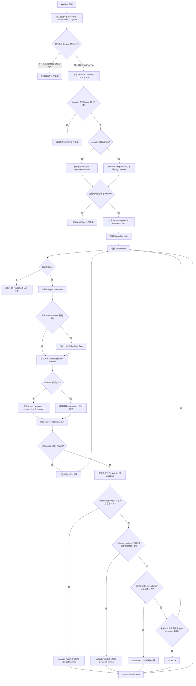
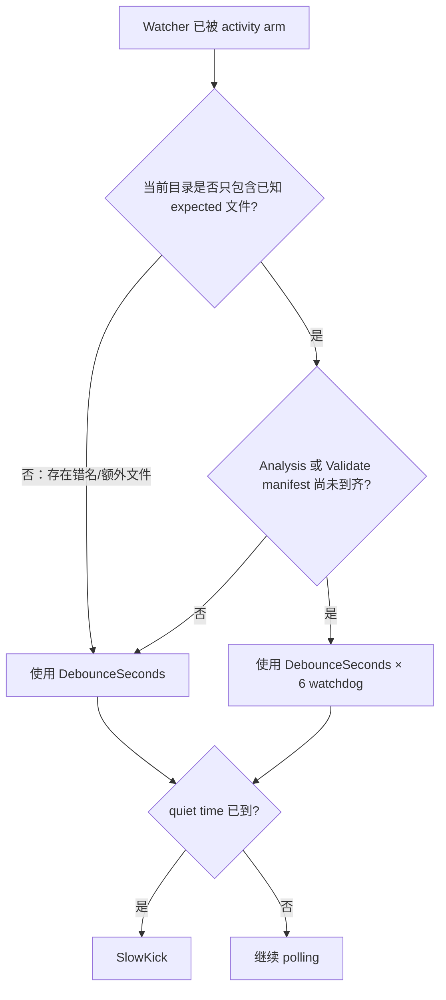

# WeCom Audit Watcher 当前设计与 User Cases

> 本文基于当前仓库中的 `Watch-WeComAuditSource.ps1`、`Invoke-WeComAuditScheduler.ps1`、`tools/Test-WatcherFastPath.ps1` 和 `tools/Test-ValidateFastPathResolver.ps1` 整理。Watcher 只负责观察 source folder 并唤醒 Scheduled Task；文件内容校验、Analysis、Validate、归档和通知仍由 Scheduler/阶段脚本负责。

## 1. Watcher 的职责边界

Watcher 使用轮询而不是 `FileSystemWatcher`，以避免 NAS/SMB change notification 不可靠的问题。每轮快照记录：

- 文件名
- 文件长度
- `LastWriteTimeUtc.Ticks`

新增文件或长度/修改时间变化会被视为 activity；纯删除不会触发 activity。文件连续两个 polling interval 未变化才被视为 stable。

Watcher 不判断文件内容是否有效，也不直接执行 Analysis 或 Validate。它最终只调用：

```powershell
Start-ScheduledTask -TaskName <TaskName>
```

重复 kick 是设计允许的，真正的幂等和并发保护由 Scheduler cycle guard、全局 mutex 以及 Scheduled Task 的 `IgnoreNew` 策略承担。

## 2. 总体流程图



### SlowKick 阈值选择



PROD 默认 `DebounceSeconds=300`，因此正确但未到齐的 manifest 最长等待阈值为 1800 秒（30 分钟）。OffDay QA 若使用 `DebounceSeconds=30`，对应 watchdog 为 180 秒（3 分钟）。发现错名或非预期文件时仍使用普通 debounce。

## 3. 所有触发通道

| 通道 | 触发条件 | 主要用途 | 是否一次性 |
|---|---|---|---|
| Analysis FastKick | 静态 Analysis expected set 全部存在且连续 2 轮稳定 | 文件齐全后立即开始 Analysis | 每个 watcher 实例一次 |
| ValidateFastKick | Analysis 完成后，从真实 RunId/summary 动态解析的 Validate expected set 全部存在且连续 2 轮稳定 | `.msg` 全部到齐后立即 Validate/归档 | 每个 watcher 实例一次 |
| StartupKick | watcher 启动前已经存在的非 Analysis-fast-path 文件仍全部存在且稳定 2 轮；Validate manifest 已知 pending 时让路 | 补偿“启动前文件没有 activity event” | 每个 watcher 实例一次 |
| SlowKick | activity 后目录保持安静达到普通 debounce 或 pending-manifest watchdog | 错名、未知文件、解析失败和未到齐文件的兜底 | 每次新 activity 可重新 arm |
| Analysis Retry Kick | `analysis-retry-state.json` 中新的 `NextRetryAt` 已到期 | 唤醒 Scheduler 重试 transient Analysis failure | 每个不同的 `NextRetryAt` 一次 |

Validate manifest 不是简单按文件数量推断，而是复用正式 Validate 预检的动态解析链路：

```text
Get-BackupValidationConfig
  -> Resolve-DynamicSummaryTaskRequirements
  -> Get-TaskSummariesByRunId -Strict
  -> Get-PreflightFiles -Phase Validate
```

解析异常不会终止 watcher；本轮保持 unresolved，下一轮继续尝试，SlowKick/FinalCheck 仍作为可靠性下限。

## 4. Watcher 覆盖的 User Cases

### 4.1 已由 watcher fast-path 回归测试覆盖

| ID | User case / 输入情形 | 当前行为 |
|---|---|---|
| Z | fast path 已触发，但之前 slow path 处于 armed | 清除 `Armed` 和 `LastChangeAt`，防止随后重复 SlowKick |
| A | 3 个 Analysis 文件分批到达，均在 watchdog 窗口内 | 到齐并稳定后只触发一次 Analysis FastKick，不提前发 missing notification |
| B | 3 个 Analysis 文件只到 2 个，之后一直不补 | 等待 pending-manifest watchdog，到期后 SlowKick，由 Scheduler 权威预检和通知 |
| C | expected `.xlsx` 实际以允许的 `.xls` twin 到达 | 视为 expected 文件，Analysis FastKick 可正常触发；后续由 Scheduler 规范化 |
| D | 文件仍在持续复制，长度/mtime 多次变化 | 稳定计数不断重置，只有最终连续 2 轮不变才 FastKick |
| E | Analysis 已完成，`.msg` 到达但 Validate manifest 暂未解析 | fast path 不误判；activity 后由 SlowKick 兜底 |
| F | source folder 只有文件删除 | 不视为新 activity，不 kick job |
| H | 全部 Analysis 文件在 watcher 启动前已存在 | 连续 2 轮稳定后 Analysis FastKick，无需等待新 filesystem activity |
| G | Analysis FastKick 后又有 `.msg` 到达，Validate manifest 未解析 | Analysis fast 与 slow 通道独立；`.msg` 可再触发 SlowKick |
| I | Analysis 文件和 `.msg` 在 watcher 启动前都已存在 | Analysis FastKick 后，startup safety net 可补 kick 预存 `.msg` |
| J | Analysis 已完成，只有 `.msg` batch 在 watcher 启动前存在 | stable 后 StartupKick |
| K | watcher 启动时发现 extra file，但随后其中一个消失 | StartupKick 不触发，避免使用不完整的初始集合 |
| L | Validate dynamic manifest 已解析，所有 expected `.msg` 已到齐 | stable 2 轮后 ValidateFastKick，早于 slow debounce |
| M | Validate manifest 仍 unresolved | 不触发 ValidateFastKick，保留 SlowKick fallback |
| N | Validate manifest 已成功解析为空集合 | 明确区别于 unresolved；不会误触发 ValidateFastKick |
| O | Analysis FastKick 后，resolved Validate `.msg` 集合随后到齐 | 独立触发 ValidateFastKick，不与 Analysis fast path 冲突 |
| P | ValidateFastKick 时 slow path 已 armed | ValidateFastKick 清除 slow arming，避免随后重复 SlowKick |
| Q | watcher 启动前只有部分 Validate expected 文件，manifest 已知 pending | StartupKick 主动让路，不因“预存文件”过早触发 missing notification |
| R | Validate 文件 A、B 分批到达，C 暂缺，但仍在 watchdog 内 | 不在普通 debounce 时提前 SlowKick |
| S | 同上，但 C 长时间不来 | watchdog 到期后触发 SlowKick |
| T | Validate 阶段出现错名或非 expected 文件 | 不享受 30 分钟放宽，按普通 debounce 快速 SlowKick |
| U | Analysis expected 文件逐个复制，暂时未到齐 | watchdog 内不提前 SlowKick |
| V | Analysis expected 集合长期不完整 | watchdog 到期后 SlowKick |
| W | Analysis 阶段出现错名或非 expected 文件 | 按普通 debounce SlowKick，不等待 pending-manifest watchdog |

Validate resolver 另有专门测试覆盖：

- 解析结果为 0 个文件时，调用方得到真正的空数组，而不是 `$null`。
- 解析结果为 1 个文件时，得到平坦字符串集合。
- 解析结果为多个文件时，得到平坦数组，不会出现 `[System.Object[]]` 嵌套数组或错误文件名。

### 4.2 由生产代码路径覆盖的运行场景

| User case | 当前行为 |
|---|---|
| 非 cycle 执行日启动 PROD watcher | 记录原因并以 exit code 0 退出，不监控目录 |
| OffDay QA 明确启用 | 仅允许 `Config.Environment='QA'` 且 TaskName 为 `WeComAudit-AutoCycle-OffDayQA`；否则拒绝运行 |
| cycle 的 Analysis 和 Validate 已全部完成 | 启动门禁直接退出，不再观察 source folder |
| 启动时已超过 `StopAt` | 不进入 polling loop，记录日志后退出 |
| 到达 watcher 窗口结束时间 | watcher 退出并把最终检查交给 FinalCheck Scheduled Task |
| 初次或某轮读取 NAS/source folder 失败 | 记录错误；初次失败使用空快照，循环中失败则跳过该轮，后续继续重试 |
| Analysis expected manifest 解析失败 | 禁用 Analysis fast path，本实例继续依靠 slow path/FinalCheck |
| Analysis 刚完成但 summary/RunId 尚未完全落盘 | Validate manifest 解析失败被隔离，下一个 polling round 重试 |
| Scheduled Task 无法启动 | `Start-ScheduledTask` 异常被捕获并写 watcher log，watcher 本身继续运行 |
| Analysis transient retry 时间到期 | 对新的 `NextRetryAt` kick 一次，避免每轮重复 kick 同一 retry timestamp |
| 同一批文件引发冗余 kick | Scheduler guard/mutex/Task Scheduler `IgnoreNew` 防止重复执行业务阶段 |

## 5. 当前明确的边界与风险

1. **启动前只有部分 Analysis expected 文件时，没有 activity 可以 arm watchdog。** 这些文件属于 Analysis expected set，因此也不属于 `InitialExtraNames`；如果启动后文件完全不再变化，既不会 FastKick，也不会启动 30 分钟 watchdog，只能等后续文件变化、FinalCheck 或人工运行。这是当前最值得补充测试和设计决策的盲点。

2. **启动前只有部分 Validate expected `.msg` 时，StartupKick 会按设计让路。** 如果 manifest 已解析、文件之后也完全不变化，watcher 同样没有 activity 来启动 watchdog，通常会等待后续 `.msg` 或 FinalCheck。这避免了过早 missing notification，但拉长了“文件永远不来”的发现时间。

3. **Watcher 只验证文件名和稳定性。** 空文件、损坏文件、内容日期错误等必须由 Scheduler 的 `Test-StagePreflight` 和 Validate 脚本判断。

4. **Validate manifest 临时解析失败主要表现为反复重试。** 这种容错不会拖垮 watcher，但若只观察控制台，可能不容易判断 summary 尚未写完还是持续存在配置/数据错误，应结合 scheduler 和 watcher 持久日志排查。

5. **`Start-ScheduledTask` 成功不代表阶段成功。** 它只表示 kick 请求被接受。最终结果应查看 Scheduled Task `LastTaskResult`、Scheduler log、run summary 和 validation log。

6. **完成后 watcher 不会在 polling loop 内主动退出。** 它会继续到 `StopAt`；不过纯删除不构成 activity，fast path 又是一次性的，因此正常 cleanup 不会再次 kick。

## 6. 时间参数的实际含义

| 参数 | PROD 默认 | 含义 |
|---|---:|---|
| `PollSeconds` | 60 秒 | 读取目录快照的频率；fast path 至少需要连续 2 个稳定 polling round |
| `DebounceSeconds` | 300 秒 | unexpected/unknown activity 的普通 quiet threshold |
| Pending manifest watchdog | `DebounceSeconds × 6` = 1800 秒 | 已知正确文件集合尚未到齐时的放宽阈值；当前为代码内部倍数，不是独立 CLI 参数 |
| `StopAt` | 18:00 | watcher 停止时间；之后由 FinalCheck 接管 |

注意：日志中的 “stable 2 polls” 是按 poll 次数判断，不保证严格等于 `2 × PollSeconds` 的墙钟时间；文件第一次被观察到或发生变化的那一轮稳定计数为 0。

## 7. 日志与排查入口

- Watcher 日志：`<LogRoot>\watcher\watcher-yyyyMMdd.log`
- Scheduler 日志：由 `Invoke-WeComAuditScheduler.ps1` 写入配置解析后的 LogRoot/run 目录
- 子脚本未处理异常：`<LogRoot>\scheduler-child-errors.log`
- Run 产物：`<LogRoot>\runs\<RunId>\...`
- Scheduled Task 状态：

```powershell
Get-ScheduledTaskInfo -TaskName 'WeComAudit-AutoCycle' |
    Format-List LastRunTime, LastTaskResult
```

OffDay QA 时将任务名替换为 `WeComAudit-AutoCycle-OffDayQA`。

## 8. 回归验证命令

```powershell
powershell.exe -NoProfile -ExecutionPolicy Bypass `
    -File .\tools\Test-WatcherFastPath.ps1

powershell.exe -NoProfile -ExecutionPolicy Bypass `
    -File .\tools\Test-ValidateFastPathResolver.ps1
```

上述测试证明 watcher 的纯状态决策和 Validate manifest 数组形状正确；真实 PROD 部署仍应额外验证 Scheduled Task 账号权限、Task Action 中的绝对 `ConfigPath`、NAS 访问以及邮件/Outlook 运行条件。
