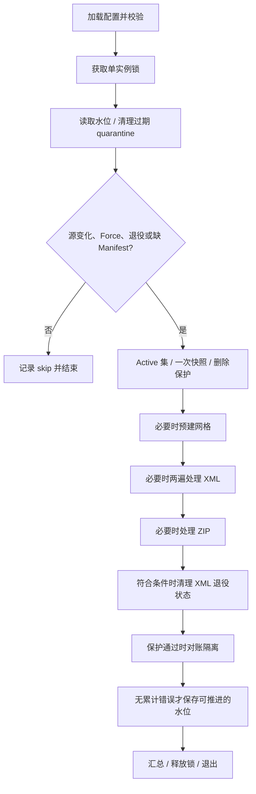

# PhotoImportTool：当前实现流程（ZIP + XML）

核对日期：2026-09-21。适用工程：`COD.FirmwideDirectory.PhotoImportTool`。本文描述当前源码，不把讨论方案当作已实现功能。手工验收见 [端到端测试用例](photo_import_e2e_user_test_cases.md)。

## 1. 当前决策

- 一个 Job 处理照片 ZIP、users DSML ZIP 和可选的 CrossFire XML，共用目标路径、照片快照、隔离区和水位。
- XML 启用时，本轮 XML 覆盖集中的 MSID 阻止 ZIP 写入；不是比较两个来源谁更新。
- ZIP 仍按文件大小判断增量，不使用 ZIP entry 时间戳，不计算内容哈希。
- 已实现：users 单独变化补图；XML 缺失文件有条件恢复；XML 字段错误不推进水位；重复 MSID 拒绝整轮 XML；负数隔离保留期拒绝运行。
- 两项 P2 暂未修改：XML 移除/退役后的同尺寸 ZIP 跳过，以及错误目录中的同名同尺寸文件阻挡 ZIP 恢复。
- “XML 退出后持续保护旧照片”“哈希一致后接管”“可信时间 newest-wins”均未实现。

## 2. 配置、输入与标准路径

程序从 EXE 所在目录读取 `appsettings.json` 的 `PhotoImport` 节。优先级从低到高：JSON、`FWD_PHOTO_` 前缀环境变量、命令行。示例：`FWD_PHOTO_PhotoImport__DryRun=true` 或 `--PhotoImport:DryRun=true`。不会自动加载 `appsettings.Production.json`，也不读取测试专用的 `FWD_TEST_*` 变量。

| 配置 | 当前含义 |
|---|---|
| `PhotoFolder` / `PhotoType` | 与 API 相同；部署/测试预先创建目录，扩展名默认 `.jpg` |
| `PhotoZipPath` | 照片 ZIP；entry 叶文件名去扩展名得到 MSID，忽略 ZIP 内目录 |
| `UsersZipPath` / `UsersDsmlName` | 真 Core 解析 DSML ZIP；需核对 ZIP 内部文件名 |
| `XmlPhotoPath` | 非空启用；空停用；启用但文件不可访问是错误，不是退役 |
| `AppliedManifestPath` | 空时取水位文件同目录的 `photo-applied-manifest.json` |
| `WatermarkFilePath` | 输入源文件级 mtime 状态 |
| `LockFilePath` | 独占锁文件；处理同一输出的实例必须协调使用同一个锁位置 |
| `LocalScratchDir` | 可选；需要扫描照片 ZIP 时先拷本地，DryRun 不拷贝 |
| `DryRun` | 不写照片/Manifest/水位/scratch/网格，不隔离或永久删除；入口仍创建并持有锁 |
| `Force` | 强制源变化判定，并绕过删除比例保护；不绕过绝对 Active 阈值，也不强制重写同尺寸/同版本照片 |
| `MinActiveThreshold` | Active 数量不足则关闭对账删除；代码默认 1，仓库 JSON 为 1000，生产按实际规模设置 |
| `MaxDeleteRatio` | `(0,1]`，默认 0.10；拟隔离比例严格超限时关闭删除，Force 可绕过 |
| `QuarantineDir` | 独立隔离目录；部署确保和 PhotoFolder 互不包含 |
| `QuarantineRetentionDays` | 默认 30，负数在 Validate 和永久清理入口拒绝；0 清理今天之前的批次 |

Job 取真 Core 解析结果中 `EmployeeStatus == Active` 且 MSID 非空的人员，忽略大小写去重。不在 Active 集也包括 DSML 中没有出现的用户。

照片 MSID 必须至少 2 个字符，且仅含字母/数字。标准目标由真 `Utility.GetUserPhotoFullPath` 计算：

```text
PhotoFolder\UPPER(msid[0])\UPPER(msid[1])\{msid}{PhotoType}
58MVN → PhotoFolder\5\8\58MVN.jpg
```

叶文件名不强制转大写。XML `Text2` 会去除首尾空白。

## 3. CrossFire XML 规则

```xml
<CrossFire>
  <SoftwareHouse.NextGen.Common.SecurityObjects.Personnel>
    <Text2>58MVN</Text2>
    <SoftwareHouse.NextGen.Common.SecurityObjects.Images>
      <Image>BASE64_OF_IMAGE</Image>
      <LastModifiedTime>8/4/2026 3:26:20 PM GMT+08:00</LastModifiedTime>
      <Thumbnail>BASE64_OF_THUMBNAIL</Thumbnail>
    </SoftwareHouse.NextGen.Common.SecurityObjects.Images>
  </SoftwareHouse.NextGen.Common.SecurityObjects.Personnel>
</CrossFire>
```

上例 Base64 为占位内容，不能直接导入。当前 `mock_photo.xml` 包含 `7G754`（无 Images）、`58MVN`（有 Image）。

- 顶层进入 CrossFire/容器子节点，不 Skip 整棵根节点；按 LocalName 识别完整点分 Personnel/Images 名称。
- `Text2` 应位于 Images 前面：第二遍按已读取的 MSID 判断是否物化图片。
- 只使用 Image，不使用 Thumbnail、ImageCaptureDate、Primary、ImageType 决定图片或版本。
- 缺 Images/Image、自闭合 Image、成对空 Image、纯空白 Image 都不产生照片记录，不进入 XML 覆盖集。
- 同一 Personnel 多个 Images 块：只处理第一个，对额外块告警；第一块为空时也不会选择后续块。一个块内多个 Image 元素采用第一个非空 Image。
- 不同 Personnel 的非空 Text2 必须唯一：Trim 后忽略大小写，包含无照片、非 Active 人员。重复抛异常，Job 拒绝整轮 XML 写入。
- 时间格式为 `M/d/yyyy h:mm:ss tt 'GMT'zzz`，InvariantCulture 解析，Manifest 按 UTC 保存。
- Base64 支持折行/空白；当前只检查能否解码，不验证解码内容一定是合法 JPEG。
- 禁止 DTD，XmlResolver 为 null；Personnel 内未知字段跳过。

## 4. 执行顺序和阶段门闸



整轮不是事务；某阶段失败不表示已完成的其他阶段回滚。

### 4.1 源门闸

每个启用的源先检查存在，再以 `File.GetLastWriteTime(path) > 已存水位` 判断变化；Force 强制变化。Key 为 `photoZip`、`usersZip`、`xmlPhoto`。

另外两种触发：

- `manifestMissing`：非 DryRun、XML 启用且 Manifest 文件不存在。
- `xmlRetired`：XML 停用且历史 Manifest 非空。

三源无变化且无上述例外时直接结束，但此前仍执行 quarantine 到期清理。同 mtime 内容替换或更早 mtime 不自动判为更新。

### 4.2 Active 集、快照与删除保护

快照条件：`photoChanged || usersChanged || xmlChanged || xmlRetired || manifestMissing || deleteEnabled`。每轮最多枚举一次照片树，保存完整路径、MSID 和长度，不读取图片内容。

枚举包含隐藏/系统文件，遇不可访问目录抛异常，在目录级跳过 `~snapshot`。非 DryRun 清理找到的 `.photoimport-tmp` 孤儿文件。

Active 数量达到绝对阈值，且拟隔离比例未超限（或 Force 绕过比例）时开启 `deleteEnabled`。比例根据写入前快照计算。

注意当前语义：`deleteEnabled` 也控制非 Active 用户跳写。保护触发时，不只停止隔离，也不再按 Active 集拦截 ZIP/XML 写入；不是整轮停止。users 水位不推进，下轮重试。

### 4.3 来源处理条件

| 阶段 | 触发条件 |
|---|---|
| XML 扫描 | XML 启用，且 photo/users/xml 任一变化或 Manifest 缺失 |
| XML 写入计划 | XML 扫描成功，且 users/xml 变化或 Manifest 缺失 |
| 仅 photo 变化时的 XML | 建覆盖集，不解码写入 XML 图片 |
| ZIP 扫描 | photo/users 变化；或 xml 变化/Manifest 缺失且 XML 处理返回成功；或 XML 退役 |
| 对账隔离 | deleteEnabled 为 true |

只有 users 变化时，新 Active 用户可从未变的 XML/ZIP 补图；已有 XML 仍按版本跳过，ZIP 仍按尺寸跳过。先建立 XML 覆盖集，保持 XML 优先。

非 DryRun、有写入可能时调用 `EnsurePhotoFolderGrid`：首次预建 36×36 网格和 `.photogrid-ready`，以后通常走标记快速路径。照片子目录缺失时写入函数可以补建。

## 5. XML 两遍处理与错误边界

两遍共用以 FileShare.Read 打开的稳定源句柄；第二遍前 Seek 到开头，拒绝正常的并发写入/替换。

### 5.1 第一遍

`XmlPhotoReader.Scan` 完整扫描后返回元数据，检查重复 MSID，不物化全部 Base64。

malformed XML、重复 MSID、第一遍读取失败：记录 Errors，取消本轮全部 XML 写入，Manifest 不改；用历史 Manifest MSID 保护旧 XML 照片不被 ZIP 覆盖。photo/users 变化时 ZIP 仍可处理其他用户。没有可信历史 Manifest 时，无法保护未知的历史 XML 照片。

### 5.2 计划与第二遍

1. 带非空图片、合法 MSID 的记录进入本轮 `xmlMsids`。
2. 本轮仅扫描，或删除保护开启且该用户非 Active 时跳过写入。
3. 待应用记录缺失/错误的 LastModifiedTime：同时增加 XmlSkipped 和 Errors；保留旧版本，仍阻止该用户 ZIP 覆盖。
4. 按真实 Utility 计算目标，使用快照完整路径集合判断存在性。Manifest 有记录、XML 版本小于等于已应用版本且标准文件存在时跳过。
5. 无记录、版本前进或标准文件缺失时生成写入计划。
6. 第二遍只读取计划内图片全文。Base64 解码失败同时增加 XmlSkipped 和 Errors；该用户旧照片和版本不改。
7. 成功时写同目录临时文件，再 Move 覆盖；写入成功后更新 Manifest 的 source、UTC version、size。DryRun 仅统计拟写入。

目标缺失时即使版本未前进也能恢复，但必须进入写入流程：全部源不变时，仅删除目标 JPG 不会触发恢复。可使用 Force 强制核对，注意删除比例保护也被绕过。

第一遍成功且本轮应用写入时，删除 Manifest 中不在当前覆盖集的历史键。成功写入过、移除过历史键或 Manifest 原先缺失时保存；空覆盖集可生成 `{}`。

结构/重复错误拒绝整轮 XML；字段/解码/逐文件写入错误属于逐条失败，其他有效记录可以成功，并保存成功部分 Manifest，但不推进整轮水位。未计划写入的旧版本照片不会重新解码校验。

## 6. ZIP 增量和 XML 移除/退役

ZIP 顺序读取，跳过目录、非目标扩展名、非法 MSID、XML 覆盖项，以及删除保护开启时的非 Active 用户。

当前快照索引为 `MSID → size`。索引显示存在且尺寸和 ZIP entry 相同则跳过，否则同目录临时写入后 Move。ZIP 无已知尺寸时不会按尺寸跳过。

### 6.1 从 XML 移除人员

XML 扫描成功并进入应用流程后，移除该用户的覆盖及 Manifest 键，再扫描 ZIP。ZIP 有图时仍按 size-only 尝试写入，不保证一定替换。

ZIP 无图且用户仍 Active：已有目标文件保留；若本来没有文件则仍无照片。**不会因为两个来源都缺图就自动隔离 Active 用户照片。**

### 6.2 停用整个 XML

XmlPhotoPath 置空且历史 Manifest 非空时，即使 ZIP 未变也回落扫描。ZIP 后累计 Errors 为 0 且非 DryRun 时清空 Manifest，移除 XML 水位；随后才对账，最终水位仅在整轮无错误时保存。

清空 Manifest 不代表每个历史 XML 用户都成功改写成 ZIP：同尺寸可能跳过，ZIP 缺图也不报接管错误。当前没有持续保留 XML 来源保护。

## 7. 隔离及永久删除

- 对账依据启动前快照和 Active 集，将非 Active 照片 Move 到 `QuarantineDir\yyyy-MM-dd\原相对路径`；同日同相对路径使用覆盖 Move。
- 永久清理在每轮门闸前执行；使用服务器本地日期和一级目录名 `yyyy-MM-dd` 判断批次年龄，不看照片 mtime。
- 删除条件：`batchDate < Today.AddDays(-RetentionDays)`；等于截止日期保留。
- 负数在 Validate 和清理入口拒绝；0 保留当天及未来批次。
- DryRun 不移动/删除，但统计拟操作数量。Purged 是批次数，不是照片数。

## 8. Manifest 与水位

```json
{
  "58MVN": {
    "source": "xml",
    "version": "2026-08-04T07:26:20+00:00",
    "size": 3891
  }
}
```

Manifest 是 XML 成功应用记录，不是当前覆盖集，也不是照片备份。当前覆盖集来自成功的 XML 扫描，可包含还没写入成功的记录；Manifest Count 不保证等于现存照片数或 Active 人数。ZIP-only 照片不记入 Manifest。

Manifest 临时文件 + Move 保存；水位直接覆盖写 JSON。两者 Load 错误按空状态处理；只有 Manifest **文件缺失**触发专门恢复门闸，存在但损坏不触发该门闸。

累计 Errors 为 0 时才推进本轮变化的 photo/xml 水位；users 水位还要求 deleteEnabled=true。DryRun 不保存水位。失败后原水位保持，下一轮重试；成功的单条 Manifest 可避免重复写入。

## 9. 日志与退出码

| 退出码 | 含义 |
|---|---|
| 0 | Job 无累计错误，或锁占用/输入未变而跳过，不保证写入或删除已执行 |
| 1 | Job 有 Errors、运行异常或已处理的取消 |
| 2 | 配置加载/校验失败，或锁获取异常传播到入口 |

锁打开时的所有 IOException 当前均按占用处理；本地锁仅协调使用同一锁文件的实例。

日志为控制台 Information，逐文件拟操作使用 Debug，默认看不到；程序没有绑定配置中的 Logging 最低级别。请结合汇总、文件内容和状态验证。

- added/updated/skipped 为 ZIP 计数；ZIP DryRun 把拟新增也记为 updated。
- xmlAdded/xmlUpdated/xmlSkipped 为 XML 计数；错误记录可同时增加 xmlSkipped 和 errors。
- deleted 为隔离照片数，purged 为永久删除批次数。
- zipPhotoCount 为合法照片 entry 数，不保证唯一 MSID；未扫描为 0。
- nasPhotoCount 为快照及增删推算，不是运行后的再次全树统计；DryRun 为原快照数量。
- 快速跳过时没有解析 Active/建立快照，汇总中的 0 不代表真实人数或目录为空。
- 外部验收可用文件哈希；工具内部没有哈希接管逻辑。

## 10. 已知限制

| 项目 | 当前行为 |
|---|---|
| P2：同尺寸回落 | XML 移除/退役时，ZIP 同尺寸不同内容可能被跳过，历史来源记录仍清除；Force 不绕过 |
| P2：错误目录同名 | ZIP 用 MSID/size 索引，错放同名同尺寸文件可能阻止标准位置恢复；XML 已按完整路径判断 |
| 普通 ZIP 增量 | 同尺寸换内容可能跳过，不比较 entry 时间或内容 |
| 源检测 | mtime 需严格增加；相同/更早时间、改变路径但时间未前进可能不处理 |
| 路径校验 | 当前只按字符串前缀禁止 quarantine 位于 PhotoFolder 下，未禁止反包含/处理目录别名；部署用互不包含的独立目录 |
| 删除保护 | Force 绕过比例阈值；保护触发不等于整轮停止 |
| 文件校验 | Base64 合法不保证 JPEG 合法；未改照片不做全面完整性校验 |
| 一致性 | 不是整轮事务；需按单写者部署，避免外部同时修改输出 |
| 图片恢复 | Manifest 不存图片字节，XML 停用后无法仅靠它恢复丢失图片 |

若未来采用退出保留、哈希追平接管或可信时间比较，需要一起调整退役门闸、Manifest 和尺寸跳过规则。本版均未实现。

## 11. 代码依据与验收边界

- [Program.cs](Program.cs)、[PhotoImportOptions.cs](PhotoImportOptions.cs)：配置、校验和入口。
- [PhotoImportJob.cs](PhotoImportJob.cs)、[XmlPhotoReader.cs](XmlPhotoReader.cs)：处理流程和读取规则。
- [AppliedManifestStore.cs](AppliedManifestStore.cs)、[WatermarkStore.cs](WatermarkStore.cs)、[SingleInstanceLock.cs](SingleInstanceLock.cs)：状态与锁。
- [Verify 测试](../COD.FirmwideDirectory.PhotoImportTool.Verify/PhotoImportJobTests.cs)：最近代码修复后 43/43 通过，使用 FakeCore。
- [真实集成测试](../COD.FirmwideDirectory.PhotoImportTool.IntegrationTests/PhotoImportIntegrationTests.cs)：需完整 Core 与正确样本；本地缺少 Core 类型/依赖，不能视为已完成真实部署验收。

本次仅校正文档。正式验收按配套手工用例记录发布版本、实际账号、配置、日志及文件证据。


