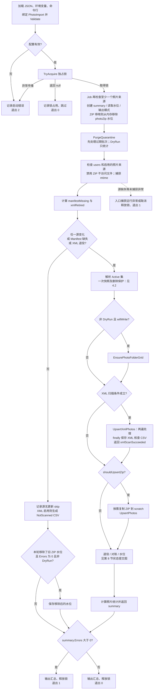
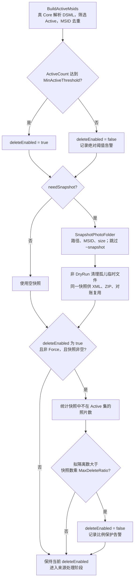
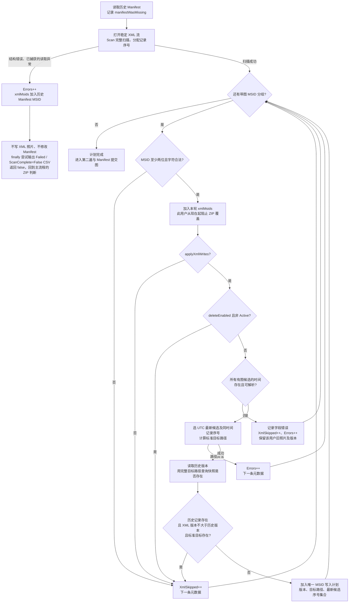
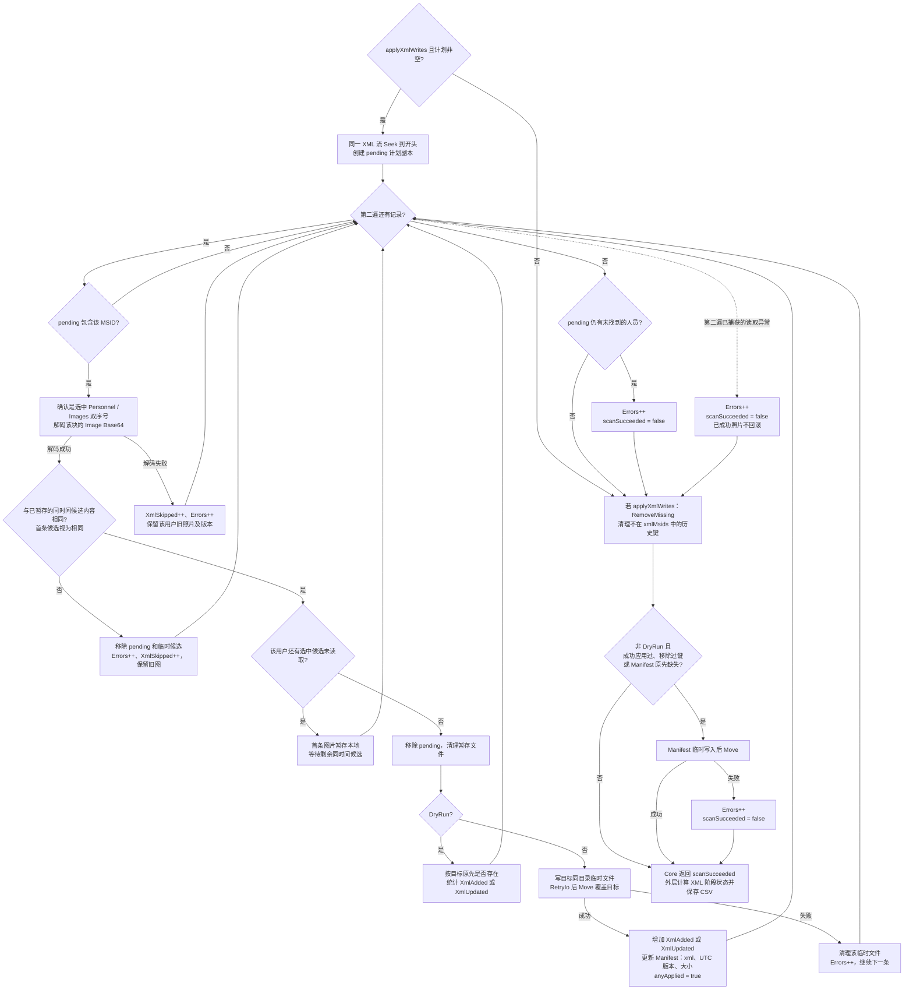
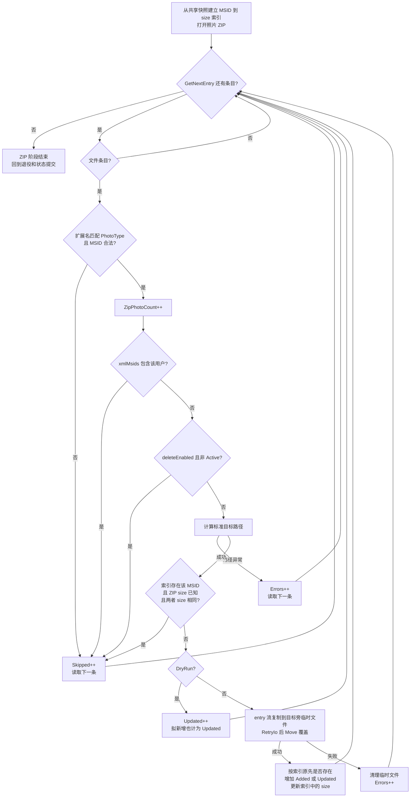
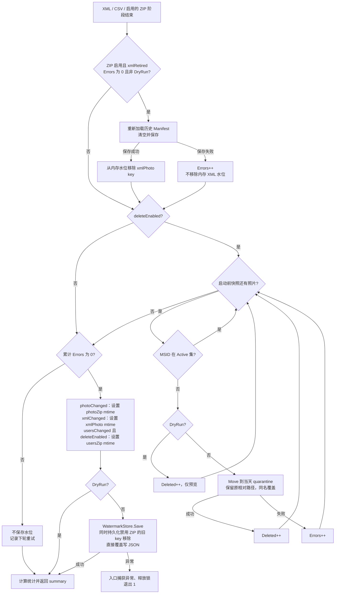

# PhotoImportTool：当前实现流程（XML-only / ZIP-only / XML 优先双来源）

核对日期：2026-09-24。适用工程：`COD.FirmwideDirectory.PhotoImportTool`。本文描述当前源码，不把讨论方案当作已实现功能。手工验收见 [端到端测试用例](photo_import_e2e_user_test_cases.md)。

## 1. 当前决策

- 一个 Job 处理必需的 users DSML ZIP，以及可选照片 ZIP / CrossFire XML；至少启用一个照片来源，共用目标路径、照片快照、隔离区和水位。
- XML 启用时，本轮 XML 覆盖集中的 MSID 阻止 ZIP 写入；不是比较两个来源谁更新。
- ZIP 仍按文件大小判断增量，不使用 ZIP entry 时间戳，不计算内容哈希。
- 已实现：users 单独变化补图；XML 缺失文件有条件恢复；XML 字段错误不推进水位；重复 MSID 合并选择最新有图记录，冲突仅阻止该用户；负数隔离保留期拒绝运行。
- 已实现：照片 ZIP 可空开关；成功禁用后清除旧 ZIP 水位并在重新启用时扫描；逐轮 XML 人员核查 CSV（含无照片及非 Active 用户）。
- 两项 P2 暂未修改：XML 移除/退役后的同尺寸 ZIP 跳过，以及错误目录中的同名同尺寸文件阻挡 ZIP 恢复。
- “XML 退出后持续保护旧照片”“哈希一致后接管”“可信时间 newest-wins”均未实现。

## 2. 配置、输入与标准路径

程序从 EXE 所在目录读取 `appsettings.json` 的 `PhotoImport` 节。优先级从低到高：JSON、`FWD_PHOTO_` 前缀环境变量、命令行。示例：`FWD_PHOTO_PhotoImport__DryRun=true` 或 `--PhotoImport:DryRun=true`。不会自动加载 `appsettings.Production.json`，也不读取测试专用的 `FWD_TEST_*` 变量。

| 配置 | 当前含义 |
|---|---|
| `PhotoFolder` / `PhotoType` | 与 API 相同；部署/测试预先创建目录，扩展名默认 `.jpg` |
| `PhotoZipPath` | 可选照片 ZIP；空禁用；entry 叶文件名去扩展名得到 MSID，忽略 ZIP 内目录 |
| `UsersZipPath` / `UsersDsmlName` | users ZIP 路径始终必填；真 Core 解析 DSML ZIP，需核对 ZIP 内部文件名 |
| `XmlPhotoPath` | 非空启用；空停用；启用但文件不可访问是错误，不是退役 |
| `AppliedManifestPath` | 空时取水位文件同目录的 `photo-applied-manifest.json` |
| `XmlAuditDirectory` | 仓库配置为服务器本地 `C:\ProgramData\FwdPhotoImport\xml-audit`；空时取运行账号 LocalApplicationData 下 `PhotoImportTool/xml-audit`，不再跟随 NAS Manifest。DryRun 也输出 |
| `WatermarkFilePath` | 输入源文件级 mtime 状态 |
| `LockFilePath` | 独占锁文件；处理同一输出的实例必须协调使用同一个锁位置 |
| `LocalScratchDir` | 可选；需要扫描照片 ZIP 时先拷本地，DryRun 不拷贝 |
| `DryRun` | 不写照片/Manifest/水位/scratch/网格，不隔离或永久删除；仍创建并持有锁，并生成 XML 核查 CSV |
| `Force` | 强制源变化判定，并绕过删除比例保护；不绕过绝对 Active 阈值，也不强制重写同尺寸/同版本照片 |
| `MinActiveThreshold` | Active 数量不足则关闭对账删除；代码默认 1，仓库 JSON 为 1000，生产按实际规模设置 |
| `MaxDeleteRatio` | `(0,1]`，默认 0.10；拟隔离比例严格超限时关闭删除，Force 可绕过 |
| `QuarantineDir` | 独立隔离目录；部署确保和 PhotoFolder 互不包含 |
| `QuarantineRetentionDays` | 默认 30，负数在 Validate 和永久清理入口拒绝；0 清理今天之前的批次 |

### 2.1 来源模式与配置校验

`PhotoZipEnabled = !string.IsNullOrWhiteSpace(PhotoZipPath)`；`XmlEnabled` 对 XmlPhotoPath 作同样判断。空字符串、空白和 null 均表示停用。

| 照片 ZIP | XML | 运行模式 |
|---|---|---|
| 停用 | 启用 | XML-only，不检查/复制/扫描照片 ZIP |
| 启用 | 停用 | ZIP-only |
| 启用 | 启用 | XML-primary-with-ZIP，XML 覆盖优先 |
| 停用 | 停用 | 拒绝启动；Job 直接调用也会在清理前拒绝 |

近期 XML-only 可在 PhotoImport 节设置 `"PhotoZipPath": ""`，并提供真实的 XmlPhotoPath 和 UsersZipPath。不是把不存在的 ZIP 文件路径当作禁用开关。
XML 已配置但不存在由 Validate 拒绝；已配置的照片 ZIP、users ZIP 在 Job 门闸检查，不存在/不可访问则报错，不静默切换来源。XML 启用时在门闸也再次检查。

### 2.2 用户与标准路径

Job 取真 Core 解析结果中 `EmployeeStatus == Active` 且 MSID 非空的人员，忽略大小写去重。不在 Active 集也包括 DSML 中没有出现的用户。

照片 MSID 必须至少 2 个字符，且仅含字母/数字。标准目标由真 `Utility.GetUserPhotoFullPath` 计算：

```text
PhotoFolder\UPPER(msid[0])\UPPER(msid[1])\{msid}{PhotoType}
58MVN → PhotoFolder\5\8\58MVN.jpg
```

叶文件名不强制转大写。XML `Text2` 会去除首尾空白。

## 3. CrossFire XML 规则

```xml
<CrossFire>
  <SoftwareHouse.NextGen.Common.SecurityObjects.Personnel>
    <Text2>58MVN</Text2>
    <SoftwareHouse.NextGen.Common.SecurityObjects.Images>
      <Image>BASE64_OF_IMAGE</Image>
      <LastModifiedTime>8/4/2026 3:26:20 PM GMT+08:00</LastModifiedTime>
      <Thumbnail>BASE64_OF_THUMBNAIL</Thumbnail>
    </SoftwareHouse.NextGen.Common.SecurityObjects.Images>
  </SoftwareHouse.NextGen.Common.SecurityObjects.Personnel>
</CrossFire>
```

上例 Base64 为占位内容，不能直接导入。当前 `mock_photo.xml` 包含 `7G754`（无 Images）、`58MVN`（有 Image）。

- 顶层进入 CrossFire/容器子节点，不 Skip 整棵根节点；按 LocalName 识别完整点分 Personnel/Images 名称。
- `Text2` 应位于 Images 前面：第二遍按已读取的 MSID 判断是否物化图片。
- 只使用 Image，不使用 Thumbnail、ImageCaptureDate、Primary、ImageType 决定图片或版本；Thumbnail 可完全缺省。元素名大小写及拼写须匹配，如 LastModifiedTime。
- 缺 Images/Image、自闭合 Image、成对空 Image、纯空白 Image 都不产生照片记录，不进入 XML 覆盖集，但第一遍人员审计仍记录这些用户（不额外增加 XmlSkipped）。
- 同一 Personnel 的所有 Images 块都参与候选输出，第一块为空不妨碍后续有图块。一个块内多个 Image 元素仍采用第一个非空 Image，时间取自该块；不将同块重复 Image 元素视作独立 Images 候选。
- 不同 Personnel 的 Text2 按 Trim、忽略大小写分组。全无图合并为无照片用户；有图和无图混合只选择有图候选；多条有图以 UTC 时间最新者为准。缺图记录不表示删除。是否 Active 始终取 users DSML。
- 对本轮需应用的用户，任一有图候选时间缺失/错误则阻止该用户更新。最新时间相同的候选在第二遍逐字节比较：相同视为同图，不同标记 ConflictingLatestImages。最新 Base64 无效不回退旧图。以上错误保留该用户照片和 Manifest 版本、维持 XML 覆盖、Errors++，其他用户继续，水位不推进。
- 时间格式为 `M/d/yyyy h:mm:ss tt 'GMT'zzz`，InvariantCulture 解析，Manifest 按 UTC 保存。
- Base64 支持折行/空白；当前只检查能否解码，不验证解码内容一定是合法 JPEG。
- 禁止 DTD，XmlResolver 为 null；Personnel 内未知字段跳过。

## 4. 执行顺序和阶段门闸

以下六张图分别对应入口总流程、删除保护、XML 扫描与计划、XML 写入、ZIP 写入、退役与状态提交。节点中的计数变化对应 `RunSummary`；图中的“下一条”表示继续当前循环。

### 4.0 入口与主流程

代码依据：`Program.Main`、`PhotoImportJob.Run`。XML、ZIP 子阶段的触发条件见 4.3，内部细节见第 5、6 节。



图中以源检查示例标出未捕获异常出口；持锁期间其他阶段抛出的未捕获异常/取消也走该出口，可能没有完成汇总。已在阶段内部捕获的错误通常计入 Errors 后继续执行。

整轮不是事务；某阶段失败不表示已完成的其他阶段回滚。快速 skip 前的清理若已累计 Errors，最终也会退出 1，并非所有 skip 都退出 0。

### 4.1 源门闸

每个启用的源先检查存在，再以 `File.GetLastWriteTime(path) > 已存水位` 判断变化；Force 强制启用的源变化。Key 为 `photoZip`、`usersZip`、`xmlPhoto`。禁用 ZIP 时 photoChanged=false、禁用 XML 时 xmlChanged=false，Force 不会启用它们。

照片 ZIP 还有首次扫描规则：启用且水位中没有 photoZip key 时，photoChanged 强制为 true，即使文件时间早于默认 UnixEpoch。users/XML 没有这项 Contains 特判，其缺失水位默认取 UnixEpoch。

另外两种触发：

- `manifestMissing`：非 DryRun、XML 启用且 Manifest 文件不存在。
- `xmlRetired`：照片 ZIP 启用、XML 停用且历史 Manifest 非空。

所有源无变化且无上述例外时快速返回，但此前仍执行 quarantine 到期清理；XML 启用时输出 NotScanned CSV。若本轮从内存移除了禁用 ZIP 的历史水位，且无错误、非 DryRun，则快速返回前也保存这一移除。
已存在水位时，同 mtime 内容替换或更早 mtime 不自动判为更新。ZIP 禁用/重新启用的规则详见 8.2。

### 4.2 Active 集、快照与删除保护

快照条件：`photoChanged || usersChanged || xmlChanged || xmlRetired || manifestMissing || deleteEnabled`。每轮最多枚举一次照片树，保存完整路径、MSID 和长度，不读取图片内容。

枚举包含隐藏/系统文件，遇不可访问目录抛异常，在目录级跳过 `~snapshot`。非 DryRun 清理找到的 `.photoimport-tmp` 孤儿文件。

Active 数量达到绝对阈值，且拟隔离比例未超限（或 Force 绕过比例）时开启 `deleteEnabled`。比例根据写入前快照计算。

注意当前语义：`deleteEnabled` 也控制非 Active 用户跳写。保护触发时，不只停止隔离，也不再按 Active 集拦截 ZIP/XML 写入；不是整轮停止。users 水位不推进，下轮重试。



Force 只跳过比例检查，不会把已经为 false 的绝对阈值结果变回 true。快照读取异常不会被当成空快照继续对账，而会向入口抛出。

### 4.3 来源处理条件

| 阶段/标志 | 对应代码条件 |
|---|---|
| usersChanged | `Force \|\| currentMtime > savedMtime` |
| photoChanged | `PhotoZipEnabled && (Force \|\| currentMtime > savedMtime \|\| !watermarks.Contains("photoZip"))`；启用时仍先检查文件存在 |
| xmlChanged | `XmlEnabled && (Force \|\| currentMtime > savedMtime)` |
| manifestMissing | `XmlEnabled && !DryRun && !File.Exists(manifestPath)` |
| xmlRetired | `PhotoZipEnabled && !XmlEnabled && historicalManifest.Count > 0` |
| willWrite（预建网格） | `photoChanged \|\| usersChanged \|\| (XmlEnabled && (xmlChanged \|\| manifestMissing))`，实际建网格还要求非 DryRun |
| XML 扫描 | `XmlEnabled && (photoChanged \|\| usersChanged \|\| xmlChanged \|\| manifestMissing)` |
| applyXmlWrites | `usersChanged \|\| xmlChanged \|\| manifestMissing`；必须先进入 XML 扫描并成功 |
| 仅 photo 变化时的 XML | applyXmlWrites=false，仅建立覆盖集 |
| shouldUpsertZip | `PhotoZipEnabled && (photoChanged \|\| usersChanged \|\| ((xmlChanged \|\| manifestMissing) && xmlScanSucceeded) \|\| xmlRetired)` |
| 对账隔离 | `deleteEnabled` |

`xmlScanSucceeded` 初始为 true，是 XML 方法的返回状态，**不是 `Errors == 0` 的同义词**。例如单条版本/Base64 错误会增加 Errors，但方法仍可能返回 true；整轮能否保存水位单独看 Errors。

只有 users 变化时，新 Active 用户可从未变且启用的 XML/ZIP 补图；已有 XML 仍按版本跳过，ZIP 仍按尺寸跳过。先建立 XML 覆盖集，保持 XML 优先。XML-only 不会因 users 或 XML 变化而访问 ZIP。

非 DryRun、有写入可能时调用 `EnsurePhotoFolderGrid`：首次预建 36×36 网格和 `.photogrid-ready`，以后通常走标记快速路径。照片子目录缺失时写入函数可以补建。

## 5. XML 两遍处理与错误边界

两遍共用以 FileShare.Read 打开的稳定源句柄；第二遍前 Seek 到开头，拒绝正常的并发写入/替换。

### 5.1 第一遍

`XmlPhotoReader.Scan` 完整扫描后返回所有带图 Images 的元数据以及从 1 开始的 Personnel RecordIndex / 块内 ImagesIndex，不物化全部 Base64。onPersonnel 每人一次（含无图、无效 MSID），onCandidate 每 Images 块一次（含空块），Job 记录 Active 状态。所有块和重复 Personnel 的候选统一按 MSID 分组，绑定 CandidateId=(RecordIndex, ImagesIndex)，不在 Personnel 内另设一套选最新逻辑。

第一遍 includeImage=false，分块消费 Image 文本以判空而不解码；每块独立读取 LastModifiedTime。第二遍 ReadSelectedRecords 只对计划内 CandidateId 设置 includeImage=true，取出 Base64 后由 Job 解码；第二遍不再读取时间。旧 ReadSelected(MSID 集合) API 保留，但 Job 不再使用它挑选重复记录。

malformed XML、第一遍读取失败：记录 Errors，取消本轮全部 XML 写入，Manifest 不改；用历史 Manifest MSID 保护旧 XML 照片不被 ZIP 覆盖。photo/users 变化时 ZIP 仍可处理其他用户。没有可信历史 Manifest 时，无法保护未知的历史 XML 照片。

### 5.2 计划与第二遍

下图展开第一遍及计划生成；元数据按忽略大小写 MSID 分组，过滤后选择最新候选。同时间候选须全部通过内容比较后才能写入该用户照片。



1. 带非空图片、合法 MSID 的记录进入本轮 `xmlMsids`。
2. 本轮仅扫描，或删除保护开启且该用户非 Active 时跳过写入。
3. 待应用用户任一有图候选缺失/错误的 LastModifiedTime：按用户增加 XmlSkipped 和 Errors；保留旧版本，仍阻止该用户 ZIP 覆盖。
4. 按真实 Utility 计算目标，使用快照完整路径集合判断存在性。Manifest 有记录、XML 版本小于等于已应用版本且标准文件存在时跳过。
5. 无记录、版本前进或标准文件缺失时生成写入计划。
6. 第二遍只读取选中记录序号的图片全文；相同最新时间候选全部解码比对后才写入。Base64 无效或同时间异图按用户增加 XmlSkipped 和 Errors；该用户旧照片和版本不改，不回落较旧图片。
7. 成功时写同目录临时文件，再 Move 覆盖；写入成功后更新 Manifest 的 source、UTC version、size。DryRun 仅统计拟写入。

目标缺失时即使版本未前进也能恢复，但必须进入写入流程：全部源不变时，仅删除目标 JPG 不会触发恢复。可使用 Force 强制核对，注意删除比例保护也被绕过。

第一遍成功且本轮应用写入时，删除 Manifest 中不在当前覆盖集的历史键。成功写入过、移除过历史键或 Manifest 原先缺失时保存；空覆盖集可生成 `{}`。

结构错误拒绝整轮 XML；字段/同时间冲突/解码/逐文件写入错误属于逐用户失败，其他有效用户可以成功，并保存成功部分 Manifest，但不推进整轮水位。仅覆盖集轮次、被 Active 过滤的用户不作候选时间裁决；已按 Manifest 跳过的旧版本不重新解码，也不验证同时间图片内容。

### 5.3 第二遍写入与 Manifest 保存



取消直接向入口传播，不沿图中 Manifest 清理/保存分支继续；外层 finally 仍尝试输出 Cancelled CSV。图中的 RemoveMissing 不会删除图片，只修改内存 Manifest；DryRun 不保存其变化。单条解码/写盘失败不会自动将 scanSucceeded 置为 false，但 Errors 会阻止最终水位提交。CSV 保存失败也会增加 Errors，不改变已计算的 XML 返回值，不回滚已写照片/Manifest。

## 6. ZIP 增量和 XML 移除/退役

仅 PhotoZipEnabled 且 shouldUpsertZip 成立时执行以下流程；禁用时记录 SourceDisabled，不复制 scratch、不打开 ZIP。ZIP 顺序读取，跳过目录、非目标扩展名、非法 MSID、XML 覆盖项，以及删除保护开启时的非 Active 用户。

当前快照索引为 `MSID → size`。索引显示存在且尺寸和 ZIP entry 相同则跳过，否则同目录临时写入后 Move。ZIP 无已知尺寸时不会按尺寸跳过。



源复制、ZIP 打开、GetNextEntry 等未被局部捕获的异常直接交入口处理，不能理解为一律“Errors++ 后继续”。XML 失败保护集可来自历史 Manifest；XML 成功时来自本轮扫描。

图中尺寸判断仍按 MSID 索引，不验证标准位置的实际存在性；XML 退役也没有绕过此判断。这两点正是当前保留的 P2。

### 6.1 从 XML 移除人员

XML 扫描成功并进入应用流程后，移除该用户的覆盖及 Manifest 键。ZIP 启用时再扫描 ZIP，有图时仍按 size-only 尝试写入，不保证一定替换；XML-only 不执行回落。

ZIP 停用或无图且用户仍 Active：已有目标文件保留；若本来没有文件则仍无照片。**不会因为两个来源都缺图就自动隔离 Active 用户照片。**

### 6.2 停用整个 XML

照片 ZIP 启用、XmlPhotoPath 置空且历史 Manifest 非空时，即使 ZIP 未变也回落扫描。ZIP 后累计 Errors 为 0 且非 DryRun 时清空 Manifest，移除内存 XML 水位；随后才对账，最终水位仅在整轮无错误时保存。
没有启用 ZIP 时不能同时停用 XML（两源均空会被拒绝），不会假定 ZIP 已接管并清空 Manifest。

清空 Manifest 不代表每个历史 XML 用户都成功改写成 ZIP：同尺寸可能跳过，ZIP 缺图也不报接管错误。当前没有持续保留 XML 来源保护。

## 7. 隔离及永久删除

- 对账依据启动前快照和 Active 集，将非 Active 照片 Move 到 `QuarantineDir\yyyy-MM-dd\原相对路径`；同日同相对路径使用覆盖 Move。
- 永久清理在每轮门闸前执行；使用服务器本地日期和一级目录名 `yyyy-MM-dd` 判断批次年龄，不看照片 mtime。
- 删除条件：`batchDate < Today.AddDays(-RetentionDays)`；等于截止日期保留。
- 负数在 Validate 和清理入口拒绝；0 保留当天及未来批次。
- DryRun 不移动/删除，但统计拟操作数量。Purged 是批次数，不是照片数。

## 8. Manifest 与水位

```json
{
  "58MVN": {
    "source": "xml",
    "version": "2026-08-04T07:26:20+00:00",
    "size": 3891
  }
}
```

Manifest 是 XML 成功应用记录，不是当前覆盖集，也不是照片备份。当前覆盖集来自成功的 XML 扫描，可包含还没写入成功的记录；Manifest Count 不保证等于现存照片数或 Active 人数。ZIP-only 照片不记入 Manifest。

Manifest 临时文件 + Move 保存；水位直接覆盖写 JSON。两者 Load 错误按空状态处理；只有 Manifest **文件缺失**触发专门恢复门闸，存在但损坏不触发该门闸。

累计 Errors 为 0 时才推进本轮变化的启用 photo/xml 水位；users 水位还要求 deleteEnabled=true。DryRun 不保存水位。业务错误时不调用 Save；Save 自身仍是直接覆盖写，I/O 失败不能保证旧文件完整。成功的单条 Manifest 可避免重复写入。

### 8.1 XML 退役、对账和水位提交顺序



需要注意三个不同的提交时点：XML 成功照片及其 Manifest 可能先保存；退役 Manifest 在对账之前清空；源水位在对账之后才保存。后续对账/水位保存失败，不会自动恢复此前的照片或 Manifest。

本轮结构错误导致 XML 方法返回 false 时，并不直接跳过本图的对账：是否隔离仍看 deleteEnabled 和 Active 集。XML “拒绝整轮”仅指 XML 导入部分。

### 8.2 ZIP 停用与重新启用

Run 加载水位后，若 ZIP 停用，立即在内存 Remove(photoZip)，但不立刻保存。正常流程无错误且非 DryRun 时随其他水位一起保存；快速返回路径在同样条件下单独保存移除。CSV/清理等错误或 DryRun 不持久化该移除。
下一次重新启用 ZIP 时，缺少 photoZip key 会触发扫描，即使 ZIP 比过去更旧。扫描不代表强制改写：XML 覆盖优先、普通 ZIP size-only 判断继续生效。
仅编辑配置关闭再开启、期间没有成功的非 DryRun 运行，无法留下停用记录，旧水位仍可能生效；此时需要 Force 手动核对。直接把非空 ZIP 路径换成另一条也不视为启停，仍有路径变化但 mtime 未增加的已知限制。

## 9. 日志与退出码

| 退出码 | 含义 |
|---|---|
| 0 | Job 无累计错误，或锁占用/输入未变而跳过，不保证写入或删除已执行 |
| 1 | Job 有 Errors、运行异常或已处理的取消 |
| 2 | 配置加载/校验失败，或锁获取异常传播到入口 |

锁打开时的所有 IOException 当前均按占用处理；本地锁仅协调使用同一锁文件的实例。

日志为控制台 Information，程序没有文件日志 provider，也没有绑定配置中的 Logging 最低级别。ZIP 部分逐文件预览仍为 Debug；XML decision/triggers、扫描与计划汇总、逐用户跳过/计划/成功写入以及 DryRun 预览已为 Information。不输出照片 Base64。

重点查找 `Photo source mode`、`XML skipped reason=`、`XML planned`、`XML photo written`、`XML audit saved path=`；字段错误、Base64/写盘失败另有 Warning。reason=VersionNotNewerAndTargetExists 的存在性来自本轮完整目标路径快照，不是日志输出时再访问 NAS。

- added/updated/skipped 为 ZIP 计数；ZIP DryRun 把拟新增也记为 updated。
- xmlAdded/xmlUpdated/xmlSkipped 为 XML 计数；错误记录可同时增加 xmlSkipped 和 errors。
- deleted 为隔离照片数，purged 为永久删除批次数。
- zipPhotoCount 为合法照片 entry 数，不保证唯一 MSID；未扫描为 0。
- nasPhotoCount 为快照及增删推算，不是运行后的再次全树统计；DryRun 为原快照数量。
- 快速跳过时没有解析 Active/建立快照，汇总中的 0 不代表真实人数或目录为空。
- 外部验收可用文件哈希；工具内部没有哈希接管逻辑。

### 9.1 XML 核查 CSV

详细操作见 [XML CSV 核查说明](xml_audit_csv.md)。输出到服务器本地 XmlAuditDirectory，默认规则见配置表；文件名为 `xml-audit-UTC时间-唯一ID.csv`。UTF-8 BOM，先写临时文件再 Move；CSV 不保存图片内容。CSV 的引号/换行被转义，可能触发 Excel 公式的字段增加前导单引号。

固定列：`RowType,Status,ScanComplete,DryRun,Msid,IsValidMsid,IsActive,HasImage,Result,Reason,RecordIndex,LastModifiedTimeUtc,SelectionResult,ImagesIndex`。
第一条为 Run；每个已读完的 Personnel 一条人员行；每个 Images 块一条 ImageCandidate；最后每个合法且去重的 MSID 一条 UserSummary。元数据内存随人员及候选数量增长，不增加一遍 XML 或 NAS 扫描。
明细的 Result/Reason 表示所属用户最终结果；ImageCandidate 的 SelectionResult 标识块的用途，如 IgnoredNoImage、OlderVersion、Selected、DuplicateSameImage、ConflictingLatestImages。Personnel 行的候选时间/选择结果为空，人员计数不因多块膨胀。因过滤/失败/旧版本跳过而未裁决的候选可能保持 NotEvaluated/SelectedCandidate。

| 字段/状态 | 含义 |
|---|---|
| Completed | 本轮 XML 应用阶段未新增错误，不代表所有用户都写图，也不代表随后 ZIP/对账成功 |
| CoverageOnly | 仅构建 XML 覆盖集，不应用 XML 写入 |
| Failed / Cancelled | XML 阶段失败/取消，部分照片可能已成功；不能据此认为回滚 |
| NotScanned | 入口源均未变的快速返回，仅 Run 行，不是零人数的完整报表 |
| ScanComplete | 第一遍完整结构解析是否成功；True 不代表所有照片解码、重复裁决或写入成功 |
| IsActive | MSID 是否在本轮 users Active 集；False 包括非 Active 及 users 中不存在者 |
| HasImage | 候选行表示该块有图；Personnel 表示任一块有图；UserSummary 表示该 MSID 任一记录有图，不表示 Base64/JPEG 已通过校验 |
| Result / Reason | Written/Added或Updated；WouldWrite/DryRun；Skipped/具体原因；Error/具体原因；异常时也可能保留 Planned 或 NotEvaluated |

全量人数核查仅使用 ScanComplete=True、RowType=UserSummary 的行，按 IsActive/HasImage 四个互斥组合计数；四类相加为去重有效 MSID 人数。原始记录数看 Personnel 行；有效 Personnel 行数减 UserSummary 行数为有效 MSID 的额外重复记录数。非法/缺失 MSID 在明细另计，不合并。Manifest 不是当轮 Active 有图清单。
无图人员不增加 XmlSkipped；保护阈值关闭 Active 过滤时，IsActive=False 仍可能写入，应查看实际 Result。初始 NotEvaluated 的 Result 默认为 Skipped，不能作为已完成处理证据。

DryRun 同样输出 CSV。XML 未启用不输出；配置/锁/users/快照等在 XML 阶段之前的错误不保证有 CSV。结构错误时 ScanComplete=False，报表只包含已读取的部分，不能按全量对账。重复本身不再使扫描失败。
CSV 状态在保存前根据 XML 返回值及该阶段 Errors 增量计算，不包含此前或后续阶段错误；保存失败则日志报错、Errors++，阻止水位推进，但不会回滚照片/Manifest。XML 外层 finally 尝试保存失败或取消报表，进程被强杀等情况不保证生成。
CSV 含 MSID，部署需要目录写权限及访问控制；代码没有自动清理 CSV，运维须设置保留/归档策略。

### 9.2 性能与本地临时数据

仍为至多两遍顺序 XML 读取、一次 NAS 目录快照。分组元数据约 O(N)，新增 CPU 主要来自时间解析及同时间最新候选解码/比较。不同时间的旧图不解码。
同时间候选需等待最后一条才能应用：第一张候选暂存 XmlAuditDirectory 下唯一 `.xml-ties-*` 目录，之后逐字节比较（无全量哈希）。内存无需同时保留所有用户的图片；本地临时空间峰值约为尚未完成的各重复组首张照片大小之和。正常退出/异常/取消时尝试清理，强杀或清理失败可能留下文件，需要运维定期检查。DryRun 也可能写这些临时数据。
CSV 从 NAS 改为本地通常减少审计网络写入，但记录行数增加为原始明细加去重汇总。本地目录需有权限和空间；显式配置仍可指定其他路径，生产请确保是本地盘而非映射共享。没有真实大文件/NAS 压测，不提供固定耗时增长百分比。

## 10. 已知限制

| 项目 | 当前行为 |
|---|---|
| P2：同尺寸回落 | XML 移除/退役时，ZIP 同尺寸不同内容可能被跳过，历史来源记录仍清除；Force 不绕过 |
| P2：错误目录同名 | ZIP 用 MSID/size 索引，错放同名同尺寸文件可能阻止标准位置恢复；XML 已按完整路径判断 |
| 普通 ZIP 增量 | 同尺寸换内容可能跳过，不比较 entry 时间或内容 |
| 源检测 | 已有水位时 mtime 需严格增加；相同/更早时间、改变路径但时间未前进可能不处理。启用 ZIP 且 key 缺失例外，强制扫描 |
| 路径校验 | 当前只按字符串前缀禁止 quarantine 位于 PhotoFolder 下，未禁止反包含/处理目录别名；部署用互不包含的独立目录 |
| 删除保护 | Force 绕过比例阈值；保护触发不等于整轮停止 |
| 文件校验 | Base64 合法不保证 JPEG 合法；未改照片不做全面完整性校验 |
| 一致性 | 不是整轮事务；需按单写者部署，避免外部同时修改输出 |
| 图片恢复 | Manifest 不存图片字节，XML 停用后无法仅靠它恢复丢失图片 |

若未来采用退出保留、哈希追平接管或可信时间比较，需要一起调整退役门闸、Manifest 和尺寸跳过规则。本版均未实现。

## 11. 代码依据与验收边界

- [Program.cs](Program.cs)、[PhotoImportOptions.cs](PhotoImportOptions.cs)：配置、校验和入口。
- [PhotoImportJob.cs](PhotoImportJob.cs)、[XmlPhotoReader.cs](XmlPhotoReader.cs)：处理流程和读取规则。
- [XmlPhotoAudit.cs](XmlPhotoAudit.cs)：人员 CSV 状态、转义与文件保存。
- [AppliedManifestStore.cs](AppliedManifestStore.cs)、[WatermarkStore.cs](WatermarkStore.cs)、[SingleInstanceLock.cs](SingleInstanceLock.cs)：状态与锁。
- [Verify 测试](../COD.FirmwideDirectory.PhotoImportTool.Verify/PhotoImportJobTests.cs)：覆盖可选 ZIP、重复合并、冲突保护、CSV、配置及日志格式化，使用 FakeCore；不替代真实 NAS 压测与完整 Core 集成验收。
- [真实集成测试](../COD.FirmwideDirectory.PhotoImportTool.IntegrationTests/PhotoImportIntegrationTests.cs)：需完整 Core 与正确样本；本地缺少 Core 类型/依赖，不能视为已完成真实部署验收。

本次仅校正文档。正式验收按配套手工用例记录发布版本、实际账号、配置、日志及文件证据。


